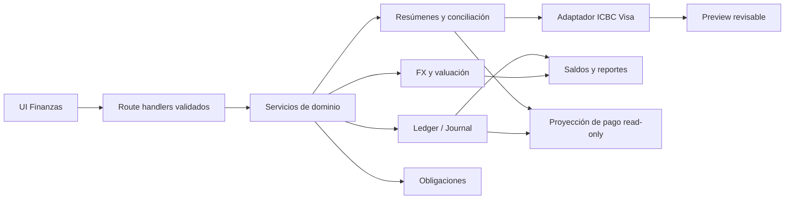

# RFC 001: OrgaLife Finance Ledger v1

- **Estado:** Accepted — listo para planificación de implementación
- **Autores:** Philip Johnson / Codex
- **Revisores:** Claude (2 pasadas), Codex (2 pasadas)
- **Fecha:** 2026-08-10
- **Última actualización:** 2026-08-10
- **Implementación:** no iniciada

## 1. Resumen ejecutivo

OrgaLife Finance Ledger v1 reemplazará el Excel que hoy se arma a fin de mes. El sistema permitirá registrar saldos e ingresos, importar un resumen ICBC Visa, revisar automáticamente consumos e impuestos, saber cuánto pagar en ARS y USD, simular los movimientos necesarios y registrar el pago sin duplicar gastos.

La fuente de verdad será un ledger de doble entrada simplificado. La interfaz seguirá usando conceptos cotidianos —cuenta, ingreso, gasto, transferencia, conversión y pago— y ocultará débitos, créditos y cuentas técnicas.

El alcance incluye cuentas argentinas y australianas, múltiples monedas, préstamos y deudas simples, conciliación de gastos manuales de tarjeta, categorización aprendida, cotizaciones automáticas con corrección manual, autenticación Google y una migración segura sin conservar los datos financieros actuales.

## 2. Problema

El módulo actual registra ingresos y gastos como filas independientes. Esto alcanza para gráficos por período, pero no puede responder de forma confiable:

- cuánto dinero existe ahora en cada cuenta;
- cuánto se debe realmente por tarjeta en ARS y USD;
- qué impuestos del resumen no se pagarán al cancelar los consumos en USD con dólares;
- cuánto quedará después de comprar USD y pagar la tarjeta;
- si una transferencia o un pago de tarjeta es un gasto nuevo o sólo un movimiento de dinero;
- cuánto dinero deben terceros y cuánto se debe a terceros;
- cómo consolidar Argentina y Australia sin perder los importes originales.

Además, el importador actual crea transacciones de gasto inmediatamente, elimina compras manuales por una regla temporal amplia y no representa la deuda ni el pago de la tarjeta. Ese modelo puede duplicar o borrar movimientos legítimos.

## 3. Resultado esperado

Al terminar el cierre mensual, el usuario debe poder afirmar:

> Subí el resumen ICBC Visa, revisé qué líneas se pagan y cuáles se excluyen, vi de qué cuentas sale el dinero, registré las conversiones y el pago, y OrgaLife muestra los saldos reales restantes.

El sistema se considera útil cuando el cierre mensual puede realizarse sin abrir el Excel anterior.

## 4. Alcance

### 4.1 Incluido en v1

- Ledger de doble entrada con historial auditable.
- Cuentas dinámicas, regiones y monedas.
- Saldos iniciales y ajustes con motivo.
- Ingresos, gastos, transferencias y conversiones FX.
- Vista Argentina, Australia y Global.
- Moneda base configurable; inicialmente USD y posteriormente AUD.
- Importación de resúmenes **ICBC Visa**.
- Clasificación revisable de consumos, cuotas, impuestos, intereses, cargos y pagos informativos.
- Exclusión de impuestos elegibles cuando la parte USD se paga en USD.
- Gastos manuales/provisionales de tarjeta y conciliación contra el resumen.
- Deuda de tarjeta separada del dinero disponible.
- Simulación de pago y registro del pago real.
- Préstamos, cuentas por cobrar y cuentas por pagar con cancelaciones parciales.
- Categorías y reglas determinísticas aprendidas a partir de correcciones.
- Registro informativo de suscripciones/compromisos de pago únicos, semanales y mensuales, conciliables contra consumos reales.
- Cotizaciones automáticas con override manual y snapshots históricos.
- Google OAuth seguro y retiro posterior del login por contraseña.
- Validación de API, idempotencia, backup, reset del módulo financiero, CI y pruebas.

### 4.2 Fuera de alcance

- Integración real con la API de Revolut.
- Importadores para Mastercard, Amex, CommBank u otros bancos.
- OCR de PDFs escaneados.
- IA para categorizar o tomar decisiones financieras.
- Sincronización bancaria automática.
- Presupuestos, inversiones, patrimonio de activos físicos o cálculo fiscal.
- Generación automática de movimientos a partir de suscripciones.
- Cálculo de ganancia o pérdida por variación del tipo de cambio.
- Rediseño mobile específico.
- Nuevas funciones de tareas, calendario o MCP.
- Migración de las transacciones financieras actuales.

Revolut quedará representado como un origen futuro de datos, pero no se realizará ninguna llamada a su API en v1.

## 5. Restricciones y supuestos aprobados

- El usuario no usa efectivo normalmente. Un retiro de cajero se registra sólo si ocurre.
- El resumen inicial es ICBC Visa.
- ICBC Visa se paga siempre por moneda facturada: saldo USD con USD y saldo ARS con ARS. Esta regla no es editable por statement.
- THB, IDR u otras monedas originales son metadatos del consumo; ICBC las factura y se pagan en USD.
- Los impuestos elegibles asociados al consumo en USD no se pagan bajo esa estrategia, aunque aparezcan en el PDF.
- No todo impuesto, interés o comisión es excluible.
- Los datos financieros actuales pueden descartarse; tareas, calendario y Kanban deben preservarse.
- Las cuentas iniciales esperadas son:
  - ICBC ARS;
  - ICBC USD;
  - AirTM USD;
  - Mercado Pago ARS;
  - Revolut AUD;
  - CommBank AUD;
  - ICBC Visa ARS y USD como pasivos de tarjeta.
- Movimientos argentinos conocidos:
  - AirTM USD → Mercado Pago ARS;
  - Mercado Pago ARS → ICBC ARS;
  - ICBC ARS → Mercado Pago ARS;
  - ICBC ARS → ICBC USD;
  - pago ICBC Visa USD desde ICBC USD;
  - pago ICBC Visa ARS desde ICBC ARS;
  - rendimiento de Mercado Pago como ingreso.
- El tipo de cambio efectivo puede ser introducido o corregido manualmente.
- Los PDFs reales son privados. Sólo fixtures anonimizados podrán incorporarse al repositorio.

## 6. Principios del diseño

1. **Una sola fuente de verdad:** los saldos se derivan del ledger; nunca se almacenan como campos mutables en una cuenta.
2. **Un movimiento económico se contabiliza una sola vez:** transferir, convertir moneda o pagar una tarjeta no crea un segundo gasto.
3. **Importar, proyectar y pagar son operaciones distintas:** importar crea/reconcilia la deuda; proyectar no escribe; pagar mueve saldos y cancela pasivos.
4. **Importes nativos inmutables:** cambiar la moneda base modifica la presentación, no los movimientos históricos.
5. **Correcciones auditables:** importes, cuentas, fecha y estado económico de una operación confirmada se corrigen mediante reversión y reemplazo. Sólo `description` y `categoryId` son metadatos editables, con registro de auditoría.
6. **Automatización revisable:** parser, matching, impuestos y categorías proponen; el usuario confirma los casos ambiguos.
7. **Fallar cerrado:** si faltan configuración, cotizaciones o datos necesarios, el sistema no inventa saldos ni autentica de forma degradada.
8. **Privacidad por defecto:** no conservar el PDF original ni texto completo cuando las líneas normalizadas y su hash alcanzan.

## 7. Arquitectura propuesta



### 7.1 Capas

- **UI:** captura intención del usuario y muestra resultados; no calcula saldos contables definitivos.
- **Route handlers:** autentican, validan DTOs y traducen errores de dominio a respuestas estables.
- **Servicios de dominio:** ejecutan cada caso de uso completo dentro de una transacción Prisma.
- **Ledger:** conserva journal entries y postings; aplica invariantes de balance.
- **Adaptadores de importación:** convierten fuentes externas en un formato normalizado, sin escribir directamente en el ledger.
- **Read models:** calculan saldos, deuda, proyecciones y gráficos a partir de datos confirmados.

Los route handlers no deberán contener reglas contables. El parser tampoco podrá crear transacciones directamente.

## 8. Modelo de dominio

Los nombres son propuestos; podrán ajustarse durante la implementación sin cambiar las responsabilidades.

### 8.1 Cuentas y ledger

#### `AccountGroup`

Agrupa cuentas visibles del mismo proveedor.

- `id`
- `name`: ICBC, Mercado Pago, AirTM, Revolut, CommBank, ICBC Visa.
- `region`: `ARGENTINA`, `AUSTRALIA`, `GLOBAL`.
- `type`: `BANK`, `WALLET`, `CARD`, `OTHER`.
- `isActive`

Se conserva este agrupamiento porque ICBC e ICBC Visa poseen saldos separados por moneda y los statements necesitan una identidad estable de tarjeta por encima de sus pasivos ARS/USD. No participa del cálculo contable.

#### `LedgerAccount`

Cuenta con saldo en una única moneda. Un grupo multimoneda tiene una cuenta por moneda.

- `id`
- `accountGroupId?`
- `name`
- `currency`: código ISO 4217.
- `kind`: `ASSET`, `LIABILITY`, `RECEIVABLE`, `PAYABLE`, `INCOME`, `EXPENSE`, `EQUITY`, `CLEARING`.
- `subtype`: banco, wallet, tarjeta, apertura, FX u otro.
- `trackingMode`: `TRANSACTIONAL` o `DECLARED`.
- `isSystem`
- `isActive`

Las cuentas técnicas de ingreso, gasto, apertura y clearing no se muestran como cuentas bancarias en la UI.

#### `JournalEntry`

Representa una operación económica completa.

- `id`
- `operationType`: ingreso, gasto, transferencia, FX, compra con tarjeta, pago de tarjeta, préstamo, cancelación, apertura, ajuste, reversión.
- `status`: `POSTED`, `PROVISIONAL`, `SUPERSEDED`, `DISMISSED`, `REVERSED`.
- `source`: `MANUAL`, `CARD_STATEMENT`, `SYSTEM`, `REVOLUT_API` reservado.
- `occurredOn`: fecha contable sin hora, almacenada como `@db.Date`.
- `description`
- `idempotencyKey?` único por origen.
- `reversalOfId?`
- `metadata` limitada y no sensible.
- timestamps.

#### `Posting`

- `id`
- `journalEntryId`
- `ledgerAccountId`
- `side`: `DEBIT` o `CREDIT`.
- `amount`: `Decimal`, siempre positivo.
- `categoryId?`
- `statementLineId?`

Los importes monetarios usarán `Decimal`, no `Float`, con escalas fijadas por el contrato antes de la migración.

La decisión de escala queda fijada para v1:

- importes: `Decimal(18,2)`;
- cotizaciones y tasas efectivas: `Decimal(18,8)`;
- aritmética contable exclusivamente con `Prisma.Decimal` en servicios de dominio;
- importes y tasas cruzan la API como strings decimales, nunca como JSON `number`.

#### `Session`

OrgaLife v1 es mono-usuario. La identidad autorizada es el email configurado; no se necesita una entidad `User` todavía.

- `id`
- `tokenHash`, único;
- `createdAt`;
- `expiresAt`;
- `revokedAt?`;
- `userAgent?`, sólo para diagnóstico y sin usarlo como factor de autenticación.

### 8.2 Invariantes del ledger

- Cada journal entry se escribe de forma atómica.
- Cada posting tiene una moneda implícita por su cuenta.
- Para una operación de una sola moneda, débitos y créditos deben ser iguales en esa moneda.
- Para FX se crean dos pares balanceados mediante cuentas técnicas de clearing, uno por moneda.
- Las cuentas `CLEARING`, `EQUITY`, `INCOME` y `EXPENSE` no participan de saldos líquidos ni posición neta.
- Ningún saldo se actualiza manualmente; se calcula desde postings activos.
- Un entry `POSTED` no cambia en sus campos económicos ni se elimina. Se crea una reversión y, si corresponde, un reemplazo. Cambiar `description` o `categoryId` genera un evento de auditoría.
- La idempotency key impide repetir una misma importación o comando.
- Un posting no puede usar una moneda distinta a la de su cuenta.
- Los entries `PROVISIONAL` nunca cambian el dinero disponible ni la deuda facturada.
- Los gastos manuales de tarjeta afectan únicamente “consumos no facturados”, “posición neta proyectada” y la proyección “después de pagar todo”.
- La UI muestra por separado dinero en cuentas, deuda facturada, consumos no facturados, remanente después de pagar lo facturado y remanente después de pagar todo.

Convención de saldo visible:

| `kind` | Saldo normal |
|---|---|
| `ASSET`, `RECEIVABLE`, `EXPENSE` | débitos − créditos |
| `LIABILITY`, `PAYABLE`, `INCOME`, `EQUITY` | créditos − débitos |
| `CLEARING` | técnico; nunca se presenta como saldo del usuario |

### 8.3 Ejemplos contables

| Acción visible | Débito | Crédito | Efecto real |
|---|---|---|---|
| Sueldo en ICBC ARS | ICBC ARS | Ingresos ARS | Sube el dinero disponible |
| Compra con débito | Gastos ARS | ICBC ARS | Baja el banco y sube el gasto |
| Compra con ICBC Visa | Gastos ARS/USD | ICBC Visa ARS/USD | Sube el gasto y la deuda; el banco no cambia |
| Cuota facturada | Gastos ARS/USD | ICBC Visa ARS/USD | Reconoce sólo la cuota del ciclo; conserva la fecha original como metadato |
| Pago de tarjeta | ICBC Visa ARS/USD | ICBC ARS/USD | Baja el banco y la deuda; no crea gasto |
| ICBC → Mercado Pago | Mercado Pago ARS | ICBC ARS | Sólo mueve dinero |
| Compra de USD | ICBC USD + clearing | ICBC ARS + clearing | Cambia la composición; no crea gasto |
| Prestar dinero | Cuenta por cobrar | Cuenta de origen | Baja el disponible y sube lo que deben |
| Cobrar préstamo | Cuenta destino | Cuenta por cobrar | Sube el disponible y baja lo que deben |
| Rendimiento de MP | Mercado Pago ARS | Ingresos/rendimientos | Sube dinero e ingreso |
| Saldo inicial positivo | Cuenta de activo | Equity de apertura | Establece el punto de partida |
| Ajuste positivo de saldo | Cuenta ajustada | Equity de ajustes | Corrige saldo sin inventar ingreso |

## 9. Saldos iniciales y ajustes

La configuración inicial solicita fecha y saldo actual para cada cuenta/moneda. Cada valor genera un entry `OPENING_BALANCE` contra una cuenta técnica de apertura.

No existirá un campo editable `balance` en la cuenta. Si un saldo fue cargado mal, se registra un `ADJUSTMENT` con:

- cuenta;
- monto y dirección;
- fecha;
- motivo obligatorio.

La contrapartida será una cuenta técnica `EQUITY` de ajustes, nunca ingreso o gasto. La UI mostrará el ajuste en el historial y separado del flujo del período.

## 10. Transferencias y conversiones FX

### 10.1 Transferencia en la misma moneda

El usuario elige cuenta de origen, destino, monto y fecha. El servicio valida:

- cuentas diferentes;
- misma moneda;
- monto positivo;
- advertencia visible si el origen quedaría negativo.

El ledger permite confirmar un saldo negativo porque puede revelar un movimiento faltante. La UI debe advertir antes de confirmar y señalar después la cuenta negativa; nunca corregirla automáticamente.

### 10.2 Conversión entre monedas

El formulario será flexible, con el modo recomendado por defecto:

- ingresar monto de origen y monto recibido;
- calcular el tipo efectivo;
- alternativamente ingresar origen + tipo y calcular destino;
- permitir corregir cualquiera antes de confirmar.

Se persisten siempre:

- cuenta y monto de origen;
- cuenta y monto de destino;
- tipo efectivo derivado;
- fecha;
- cotización de referencia, si existía;
- origen de la cotización: proveedor o manual.

Las comisiones no tendrán entidad propia en v1; quedan absorbidas en el tipo efectivo. Si el usuario desea analizarlas por separado, será una ampliación posterior.

### 10.3 `ExchangeRateSnapshot`

- par canónico con USD como pivote;
- rate `Decimal`;
- proveedor;
- `observedAt`;
- `appliedAt`;
- `isManualOverride`;

El proveedor concreto de v1 será **Open Exchange Rates**, cuya API documenta ARS y AUD y ofrece una base USD compatible con el pivote elegido. La integración usará un App ID configurado como secret, timeout, caché y fallback manual. Referencias: [autenticación](https://docs.openexchangerates.org/reference/authentication), [monedas soportadas](https://docs.openexchangerates.org/reference/supported-currencies).

La actualización es lazy: al abrir un reporte o formulario que necesita valuación, el servidor reutiliza el snapshot vigente o intenta obtener uno nuevo. V1 no incorpora cron. Un fallo conserva el último snapshot y habilita carga manual.

Reglas de resolución:

1. Todos los snapshots automáticos se normalizan como “un USD equivale a N unidades de la moneda quote”.
2. Se busca snapshot exacto para la fecha contable.
3. Si no existe, se usa el último snapshot anterior con antigüedad máxima de siete días.
4. La triangulación se permite sólo vía USD y ambos tramos usan el mismo snapshot resuelto.
5. Para posición actual, un snapshot automático de más de 36 horas se muestra como desactualizado.
6. Si falta una tasa válida, el importe nativo se muestra y el consolidado queda marcado como incompleto; nunca se convierte a cero.
7. Un override manual crea otro snapshot identificado y no reescribe el automático.
8. Una conversión real guarda siempre los dos importes y su tasa efectiva; esa tasa prevalece sobre la referencia automática para esa operación.

## 11. Moneda base y vistas regionales

La moneda base vive en configuración y puede cambiar de USD a AUD sin migrar movimientos.

Los reportes deben distinguir:

- **Saldos nativos:** verdad por cuenta y moneda.
- **Posición líquida:** activos disponibles, sin incluir lo que deben terceros.
- **Posición neta confirmada:** activos + cuentas por cobrar − deuda de tarjeta facturada − cuentas por pagar; excluye provisionales.
- **Posición neta proyectada:** posición neta confirmada − consumos no facturados; siempre se etiqueta como proyectada.
- **Flujo del período:** ingresos − gastos, excluyendo transferencias, FX y pagos de tarjeta.
- **Consolidado:** valuación en moneda base con cotizaciones identificables.
- **Suscripciones/compromisos:** información esperada sin efecto contable hasta que exista un consumo real.

Filtros:

- Argentina;
- Australia;
- Global.

Para flujos históricos se usa la cotización resuelta para la fecha contable. Para posición actual se usa el último snapshot elegido. Cambiar la moneda base recalcula la vista, no modifica el ledger.

V1 muestra el valor actual convertido, pero no calcula ni presenta ganancia/pérdida cambiaria. Los residuos de las cuentas técnicas FX se excluyen de todas las magnitudes visibles.

Las cuentas se presentan según `trackingMode`:

- **`TRANSACTIONAL`:** se espera registrar cada movimiento y puede conciliarse contra el saldo externo.
- **`DECLARED`:** se carga un opening balance y luego ajustes periódicos; la UI muestra “saldo declarado” y la fecha de última actualización.

ICBC, AirTM, Mercado Pago e ICBC Visa comienzan como `TRANSACTIONAL`. Revolut y CommBank comienzan como `DECLARED` hasta contar con integraciones. La vista Global puede incluirlas, pero debe señalar su antigüedad para no presentar una precisión inexistente.

Política de provisionales:

| Magnitud | Tratamiento |
|---|---|
| Dinero en cuentas / posición líquida | excluye provisionales |
| Deuda facturada | excluye provisionales |
| Consumos no facturados | sólo provisionales |
| Posición neta confirmada | excluye provisionales |
| Posición neta proyectada | confirmada − provisionales, etiquetada |
| Flujo confirmado | excluye provisionales |
| Flujo estimado | confirmado + provisionales, etiquetado |
| Después de pagar lo facturado | activos líquidos − deuda facturada |
| Después de pagar todo | activos líquidos − deuda facturada − consumos no facturados |

## 12. Importación ICBC Visa

### 12.1 Flujo

1. Seleccionar PDF.
2. Validar archivo antes de parsear.
3. Calcular hash y recuperar el draft existente o rechazar un duplicado confirmado.
4. Parsear con el adaptador versionado `ICBC_VISA`.
5. Persistir un `CardStatement` `DRAFT` con totales, líneas, categorías, exclusiones y matches propuestos, sin crear postings.
6. Mostrar diferencias entre totales del PDF y suma de líneas.
7. El usuario corrige clasificación, categoría o conciliación.
8. Confirmar todo dentro de una única transacción de base de datos.

Subir el archivo no modifica balances. Confirmar el preview sí crea/reconcilia entries y pasivos. Los drafts abandonados por más de 30 días pueden eliminarse mediante una tarea de mantenimiento; no forman parte del ledger.

### 12.2 Seguridad y privacidad del upload

- Aceptar sólo un archivo por request.
- Límite inicial propuesto: 10 MiB, configurable.
- Validar MIME, extensión y magic bytes `%PDF-`.
- No devolver errores internos de `pdfjs` al cliente.
- No conservar el binario original por defecto.
- No persistir texto completo si no es necesario para auditoría funcional.
- Persistir hash, versión del parser y líneas normalizadas.
- Logs sin contenido del resumen ni datos personales.

### 12.3 Modelo de resumen

#### `CardStatement`

- tarjeta;
- ciclo desde/hasta, cuando el PDF permita obtenerlo;
- fecha de cierre y vencimiento;
- hash del documento;
- número de revisión, incrementado al reimportar un documento revertido;
- `confirmationKey`, derivada de tarjeta + hash + revisión;
- versión del parser;
- regla de pago heredada de la tarjeta: `BY_BILLED_CURRENCY`;
- estado persistido: `DRAFT`, `CONFIRMED`, `REVERSED`.

`PARTIALLY_PAID` y `PAID` son estados derivados de allocations, no valores persistidos.

#### `CardStatementTotal`

Una fila por moneda:

- total informado por el PDF;
- saldo anterior informado;
- pagos/créditos informados;
- cargos nuevos calculados;
- total excluible;
- total pagadero calculado;

Total pagado y pendiente se derivan de `CardPaymentAllocation`; no se almacenan aquí.

#### `CardStatementLine`

- descripción original normalizada;
- `purchaseOn`: fecha original de compra;
- `billedOn`: fecha contable del ciclo;
- moneda e importe del resumen;
- moneda e importe original, si aparecen;
- información de cuota;
- clasificación;
- tratamiento de pago;
- categoría propuesta/confirmada;
- entry contable asociado;
- fingerprint estable dentro del documento.

Una cuota se reconoce como gasto y pasivo únicamente por el importe facturado en ese ciclo. Su `occurredOn` es `billedOn`; `purchaseOn` conserva la fecha original sin reescribir períodos pasados.

Clasificaciones mínimas:

- `PURCHASE`;
- `ELIGIBLE_USD_TAX`;
- `PAYABLE_TAX`;
- `INTEREST`;
- `FEE`;
- `PAYMENT_OR_CREDIT`;
- `PREVIOUS_BALANCE`;
- `INFORMATIONAL`;
- `UNKNOWN`.

Tratamientos mínimos:

- `PAYABLE`;
- `EXCLUDED_FROM_PAYMENT`;
- `INFORMATIONAL`;
- `NEEDS_REVIEW`.

Una línea no debe excluirse sólo porque contenga la palabra “impuesto”. La regla depende de una clasificación explícita y de la política fija `BY_BILLED_CURRENCY`.

### 12.4 Impuestos y pago por moneda facturada

Para la política fija aprobada:

- los consumos USD forman deuda USD;
- los consumos ARS forman deuda ARS;
- sólo los impuestos identificados como elegibles por pagar USD con USD se restan del total ARS pagadero;
- intereses, sellos, comisiones u otros cargos siguen siendo pagaderos salvo regla confirmada;
- las líneas excluidas se conservan para auditoría, pero no crean gasto ni pasivo.
- el pasivo nuevo se crea sólo por compras, cuotas, intereses, fees e impuestos pagaderos del ciclo; nunca se vuelve a crear por el saldo anterior.
- saldo anterior y pagos/créditos se concilian contra el pasivo y los pagos ya existentes en el ledger.

El preview debe mostrar esta reconciliación:

```text
Saldo anterior informado
+ compras/cuotas/cargos/impuestos nuevos
− pagos y créditos informados
= total de cierre informado

Total de cierre informado
− impuestos elegibles excluidos
= total propuesto a pagar en esa moneda
```

La primera ecuación se valida por moneda. Para explicar el saldo anterior del banco se usa:

```text
Saldo anterior esperado por el banco
= pasivo confirmado del ledger al cierre anterior
+ exclusiones PENDING_CONFIRMATION de esa tarjeta y moneda
```

La diferencia explicada exactamente por exclusiones pendientes no crea pasivo ni adjustment: se presenta como conciliación fiscal obligatoria dentro del preview. Cada pago/crédito debe vincularse a un entry existente o registrarse explícitamente. Los intereses por financiación son gasto nuevo.

La tolerancia es `0,01` por moneda. Sólo la diferencia residual después de imputar pasivo, exclusiones pendientes y pagos/créditos bloquea la confirmación; no se permite resolver una exclusión fiscal mediante un adjustment genérico contra equity.

Una exclusión elegible crea un registro `TaxExclusion` con estado `PENDING_CONFIRMATION`. En el siguiente resumen:

- si el saldo anterior ya no la incluye, pasa a `CONFIRMED_NOT_CHARGED`;
- si el saldo anterior la incluye pero existe un crédito/reverso compensatorio, ese crédito se vincula y pasa a `CONFIRMED_NOT_CHARGED`;
- si permanece dentro del saldo de cierre sin compensación, o reaparece como línea, queda `NEEDS_REVIEW`, nunca se excluye automáticamente y, tras confirmación del usuario, pasa a `CHARGED` y crea gasto/pasivo en el ciclo actual.

El parser exacto de estas ramas se fija con dos resúmenes ICBC consecutivos. La arquitectura no presupone si ICBC lo muestra como crédito, dentro del saldo anterior o como línea nueva.

La inspección local de cuatro ciclos consecutivos el 2026-08-10 fijó el camino normal observado para ICBC Visa: el impuesto elegible queda incluido en el total de cierre del ciclo; el usuario paga el total ARS menos esa exclusión; en el resumen siguiente ICBC informa el saldo anterior completo y agrega una línea `DEV.IMP. RG 5617` por exactamente el importe excluido, además del pago ARS realizado. El parser debe vincular ese crédito con la `TaxExclusion` pendiente y resolverla como `CONFIRMED_NOT_CHARGED`. Las otras ramas se conservan como defensa ante layouts o comportamientos futuros.

Como la política de pago no es editable, corregir una confirmación requiere `REVERSE_STATEMENT` y nueva confirmación.

### 12.5 Idempotencia

- Un índice parcial único en base protege `(cardId, documentHash)` cuando `status = CONFIRMED`; un statement `REVERSED` permite crear una nueva revisión del mismo documento.
- El servidor deriva `confirmationKey` desde `(cardId, documentHash, revision)` y bloquea la fila del draft durante la transición única `DRAFT → CONFIRMED`.
- Cada journal entry importado usa una clave propia derivada de `(statementId, lineFingerprint)`; comandos manuales reciben una UUID del cliente.
- Una segunda confirmación se traduce a `409` e incluye el id del statement ya confirmado.
- Deshabilitar el botón es sólo feedback de UI; la garantía vive en la transacción y el constraint de base.
- No se crean statements ni journal entries parciales si una línea falla.

### 12.6 Reversión de un statement

`REVERSE_STATEMENT` es una operación de dominio atómica:

1. revierte todos los journal entries creados por el statement;
2. restaura a `PROVISIONAL` cada entrada conciliada que había quedado `SUPERSEDED`;
3. libera las `CardPaymentAllocation`, sin revertir pagos bancarios reales, que quedan visibles como pagos sin asignar de esa tarjeta y moneda;
4. cierra/cancela exclusiones pendientes nacidas del statement;
5. marca el statement `REVERSED` y conserva toda la trazabilidad.

No puede revertirse parcialmente. La UI debe advertir si existen pagos asignados y mostrar dónde quedarán después de liberarlos.

## 13. Gastos manuales y conciliación

Un gasto manual con tarjeta es provisional, pero útil durante el mes. Aumenta consumos no facturados y reduce la posición neta proyectada; no modifica dinero en cuentas ni deuda facturada.

Al confirmar el resumen:

1. se buscan candidatos por tarjeta, ciclo, moneda, monto, fecha y descripción normalizada;
2. matches inequívocos se proponen automáticamente;
3. matches ambiguos requieren confirmación;
4. una línea sin match crea un entry nuevo;
5. un provisional sin match permanece pendiente para el siguiente ciclo o revisión;
6. nunca se eliminan todos los manuales anteriores a una fecha.

Una compra manual cargada por el total de un plan de cuotas no se concilia automáticamente contra una cuota individual: queda `NEEDS_REVIEW`.

Todo provisional admite cierre manual auditado:

- **`SUPERSEDED`:** el usuario lo vincula con una o más líneas autoritativas. Esto permite cerrar el total manual de una compra en cuotas contra las cuotas elegidas, sin exigir igualdad uno-a-uno.
- **`DISMISSED`:** el usuario lo descarta con motivo obligatorio porque era erróneo, duplicado o ya no corresponde.

Mientras siga `PROVISIONAL` puede corregirse. `SUPERSEDED` y `DISMISSED` son terminales y dejan de participar en consumos no facturados y posición proyectada. Ninguno requiere reversión económica porque jamás integró el ledger confirmado.

Cuando un provisional es reemplazado:

- se crea el entry autoritativo del statement;
- el original cambia de `PROVISIONAL` a `SUPERSEDED` y queda enlazado mediante `CardReconciliation`;
- no se crea una reversión económica porque el provisional nunca formó parte del ledger confirmado;
- la UI normal oculta el provisional reemplazado, pero el detalle puede verlo.

Este proceso conserva historial y evita doble contabilización.

## 14. Deuda y pago de tarjeta

Confirmar un resumen crea pasivo sólo por cargos nuevos del ciclo y concilia saldo anterior/pagos. No toca ICBC ARS ni ICBC USD.

### 14.1 Proyección read-only

La proyección recibe:

- saldo ICBC USD;
- saldo ICBC ARS;
- otros saldos habilitados para cubrir el pago, por ejemplo Mercado Pago;
- deuda pagadera USD y ARS;
- consumos no facturados, mostrados por separado;
- tipo de cambio propuesto para comprar USD;
- montos que el usuario planea transferir.

Devuelve:

- USD disponibles y faltantes;
- ARS necesarios para comprar el faltante USD;
- ARS necesarios para la parte ARS;
- transferencias sugeridas;
- saldo proyectado por cuenta;
- superávit o faltante después de pagar lo facturado;
- superávit o faltante después de pagar también lo no facturado.

Proyectar no crea entries, no reserva fondos y no cambia estados.

### 14.2 Registrar movimientos y pago

El usuario registra primero las transferencias/FX realmente ejecutadas. Luego “Registrar pago” crea un entry por moneda:

- crédito en ICBC ARS/USD;
- débito en el pasivo ICBC Visa correspondiente.

`CardPaymentAllocation` vincula el pago con el statement. El modelo admite pagos parciales; la UI propone pagar el total pendiente por defecto. El estado se deriva de las allocations, no de un booleano editable.

Antes de proponer o crear un pago nuevo, el sistema busca pagos sin asignar de la misma tarjeta y moneda:

1. los muestra y propone reasignarlos al statement;
2. resta su importe de cualquier propuesta de pago nuevo;
3. bloquea la creación duplicada mientras exista un pago sin asignar suficiente;
4. permite asignación parcial o total sin crear otro journal entry.

Tras `REVERSE_STATEMENT` y reconfirmación, el camino normal es reasignar el pago real existente. Sólo “Registrar pago nuevo” mueve nuevamente el banco.

La tarjeta siempre se cancela por moneda facturada. Una compra originalmente en THB o IDR que ICBC convirtió a USD incrementa y cancela el pasivo USD.

## 15. Préstamos, cuentas por cobrar y por pagar

#### `Obligation`

- dirección: `RECEIVABLE` o `PAYABLE`;
- contraparte;
- descripción;
- moneda e importe original;
- saldo pendiente derivado;
- fecha opcional de vencimiento;
- estado derivado: abierto, parcial o cancelado;
- entry de origen opcional.

#### `ObligationSettlement`

Vincula una cancelación parcial o total con su journal entry.

`Obligation` funciona como submayor: existe una cuenta técnica `RECEIVABLE` y otra `PAYABLE` por moneda. La suma de saldos pendientes de obligations debe igualar el saldo del ledger correspondiente en cada moneda. Esta invariante se verifica después de cada mutación y en tests.

Casos soportados:

- “Presté dinero ahora”: salida desde una cuenta y alta de receivable en una sola operación.
- “Ya me debían al comenzar”: opening balance de receivable, sin inventar un ingreso.
- “Me pagaron una parte”: entrada a la cuenta elegida y reducción parcial del receivable.
- “Debo dinero”: alta de payable con origen explícito.
- “Pagué una parte”: salida de cuenta y reducción parcial del payable.

La UI debe impedir registrar dos veces el movimiento de origen cuando la obligación ya nació desde una operación del ledger.

## 16. Categorías y compromisos recurrentes

### 16.1 Categorías y reglas aprendidas

La categoría describe para qué fue un ingreso o gasto; no reemplaza la cuenta desde la cual se pagó.

#### `CategoryRule`

- patrón normalizado de comercio/descripción;
- categoría;
- prioridad;
- origen `USER_CONFIRMED`;
- última utilización;
- activa/inactiva.

Cuando el usuario corrige una categoría puede elegir guardar la regla. En imports futuros:

- coincidencia exacta normalizada tiene prioridad;
- reglas más específicas ganan sobre reglas generales;
- ninguna regla puede excluir impuestos ni alterar montos;
- el usuario siempre puede corregir el resultado.

No se usará IA en v1.

Se conserva `CategoryRule` porque el usuario eligió explícitamente aprender de sus correcciones y reducir la recategorización mensual. V1 no requiere un editor avanzado de reglas: alcanza con crear/desactivar desde la corrección de una línea.

### 16.2 Suscripciones y otros compromisos informativos

`RecurringCommitment` registra pagos esperados como Netflix sin crear movimientos ni modificar saldos, deuda o proyecciones.

- nombre;
- importe esperado y moneda;
- frecuencia: `ONCE`, `WEEKLY` o `MONTHLY`;
- fecha de inicio;
- fecha de finalización opcional;
- categoría;
- cuenta o tarjeta esperada;
- estado activo/cancelado.

Cuando un consumo real aparece en el statement puede vincularse al compromiso para mostrar esperado vs. cobrado y detectar aumentos. La conciliación no modifica el asiento del consumo.

La vista informa:

- compromisos activos;
- total esperado por frecuencia;
- promedio mensual;
- diferencia entre esperado y cobrado;
- compromisos sin cargo observado.

Para un compromiso semanal, el promedio mensual es `importe × 52 / 12`, no `importe × 4`. `ONCE` participa sólo en el período que contiene su fecha esperada.

## 17. API y servicios de dominio

Los endpoints definitivos podrán agruparse bajo `/api/finance/v1`. Casos de uso mínimos:

- crear/desactivar cuentas y registrar saldos iniciales;
- registrar ingreso, gasto, transferencia, FX y ajuste;
- listar ledger y saldos;
- subir y previsualizar ICBC Visa;
- confirmar/rechazar import;
- resolver conciliaciones y cerrar provisionales manualmente;
- proyectar pago de tarjeta;
- registrar un pago nuevo y asignar/reasignar pagos existentes;
- crear/cancelar obligaciones;
- gestionar categorías y reglas;
- gestionar compromisos recurrentes y vincular consumos reales;
- obtener cotizaciones y registrar overrides;
- devolver dashboard regional/global.

Todos los payloads de mutación tendrán schemas runtime compartidos. Errores estables:

- `400` payload inválido;
- `401/403` autenticación/autorización;
- `409` duplicado o conflicto de estado;
- `413/415` archivo demasiado grande o formato no admitido;
- `422` PDF válido pero no interpretable/reconciliable;
- `500` error interno sin detalles sensibles.

Los DTOs monetarios transportan importes y cotizaciones como strings decimales. Las fechas contables usan `YYYY-MM-DD` y semántica de fecha civil sin zona horaria: no se construyen con `new Date("YYYY-MM-DD")` ni se convierten implícitamente a UTC. Esto preserva tanto fechas argentinas como australianas. Timestamps técnicos como `createdAt` continúan en UTC.

Cada caso de uso contable debe ejecutar en una única transacción Prisma y validar sus invariantes antes de confirmar.

## 18. Autenticación y seguridad

### 18.1 Decisión

Google OAuth será el único login público después de un rollout validado. No habrá una contraseña permanente como fallback público.

### 18.2 Flujo requerido

- Authorization Code Flow con `state`, `nonce` y PKCE cuando corresponda.
- Validar criptográficamente el ID token mediante una librería OIDC mantenida.
- Validar firma/JWKS, `iss`, `aud`, `exp`, `nonce`, `email_verified` y email permitido.
- Probar rotación de claves.
- Ejecutar en la Etapa 0 un spike desde el VPS para confirmar endpoints Google, code exchange y JWKS.
- Construir el callback desde `PUBLIC_BASE_URL`, nunca desde `request.url` detrás del reverse proxy.
- Si el VPS no tiene egress, no usar decodificación sin firma como fallback: se endurece la sesión actual, se mantiene temporalmente el login por contraseña y el desarrollo financiero continúa. Google-only queda condicionado a resolver la red.

### 18.3 Sesión

- Token opaco aleatorio de alta entropía.
- Guardar sólo su hash en base de datos.
- Cookie `HttpOnly`, `Secure` en producción, `SameSite=Lax`, expiración y revocación.
- Rotar la sesión al autenticar.
- Logout invalida servidor y cookie.
- No derivar una sesión global desde una contraseña o secreto compartido.
- La migración a `Session` invalida todas las cookies HMAC anteriores; no existe compatibilidad silenciosa entre ambos formatos.

### 18.4 Rollout

1. Corregir y probar Google OAuth.
2. Mantener ambos logins sólo durante la ventana de validación.
3. Confirmar acceso real en producción.
4. Probar la recuperación administrativa desde VPS/configuración.
5. Eliminar endpoint y UI de contraseña.

El bearer token del MCP se valida con política **default-deny** en `proxy.ts`: sólo puede habilitar los prefijos explícitos de boards, columns, tasks, subtasks y tags que consume el MCP. Nunca habilita páginas UI, `/api/finance/**`, `/api/auth/**` ni una ruta futura por defecto. Exponer finanzas al MCP queda fuera del alcance.

### 18.5 Controles adicionales

- Validación CSRF/origin en mutaciones autenticadas.
- Secrets sólo en configuración del entorno.
- Postgres local ligado a loopback y credenciales locales no versionadas.
- Temporales de backup con nombre aleatorio, permisos `0600` y cleanup mediante `trap`.
- Sanitización de logs y errores.
- Dependencias y advisories revisados en CI cuando exista acceso de red.

## 19. Backup, reset y migración

No se migrarán los movimientos financieros actuales.

### 19.1 Estrategia

1. Crear `backup-prod.command`, separado de sincronización y restore.
2. Endurecer los scripts de restore/sync para que nunca borren antes de tomar y verificar un backup.
3. Crear y verificar un backup completo antes del reset.
4. Introducir las tablas nuevas de forma aditiva.
5. Implementar y probar el ledger en desarrollo con fixtures.
6. Ejecutar un reset **allowlisted** sólo sobre tablas financieras antiguas.
7. Preservar y verificar conteos/checksums de Board, Column, Task, Subtask y Tag.
8. Crear cuentas iniciales y opening balances mediante el onboarding.
9. Activar la nueva UI financiera.
10. Eliminar tablas antiguas sólo en una migración posterior, cuando la nueva versión esté validada.

`backup-prod.command` escribe un dump con timestamp en un directorio privado configurable fuera del repositorio, permisos `0600`, checksum y reporte de conteos. Se verifica restaurándolo en una base scratch antes de marcarlo utilizable.

### 19.2 Guardas destructivas

- El reset debe requerir entorno y confirmación explícitos.
- Debe listar las tablas que tocará antes de ejecutar.
- No puede aceptar globs ni nombres proporcionados libremente.
- Debe abortar si no existe un backup reciente verificado.
- Debe generar un reporte antes/después.
- Debe existir un procedimiento de restore ensayado en local.
- El reset es un script operativo manual independiente; nunca forma parte de una migración Prisma ni del arranque del contenedor.
- `push-db-to-prod.command` queda prohibido durante la migración y, antes de volver a habilitarse, debe tomar/verificar un backup de producción previo a cualquier `DROP`.

## 20. Observabilidad y auditoría

Registrar eventos estructurados sin datos financieros detallados:

- import iniciado/confirmado/rechazado;
- hash duplicado;
- parser y versión;
- cantidad de líneas por clasificación;
- diferencia de reconciliación;
- journal entry creado/revertido;
- pago asignado;
- fallo de invariant;
- fallo de proveedor FX;
- login exitoso/fallido sin tokens ni email completo.

V1 no requiere una pantalla de auditoría separada. El detalle de cada entry debe permitir rastrear una línea de statement hasta su conciliación, reversión y pago.

## 21. Estrategia de pruebas

### 21.1 Unitarias

- balance de postings por operación;
- ingreso, gasto, transferencia, FX, tarjeta, pago y reversión;
- cálculo regional/global;
- cambio de moneda base;
- proyección de pago;
- clasificación de impuestos;
- matching de provisionales;
- reglas de categoría;
- obligaciones y cancelaciones parciales;
- convención de signos por `kind`;
- suscripciones semanales/mensuales/únicas sin postings;
- resolución y triangulación FX.

### 21.2 Parser

Crear fixtures anonimizados derivados de 2–3 PDFs ICBC Visa reales:

- compras ARS;
- compras USD;
- moneda original distinta;
- cuotas;
- impuestos elegibles;
- impuestos/cargos pagaderos;
- pagos o créditos informativos;
- saldo anterior y financiación;
- dos ciclos consecutivos con exclusión fiscal: saldo anterior, crédito/reverso y eventual recobro;
- múltiples páginas;
- descripción repetida;
- layout no soportado y archivo corrupto.

Cada fixture tendrá expected output estable y versión de parser.

### 21.3 Integración

- transacciones Prisma con rollback;
- idempotencia concurrente;
- confirmación de statement atómica;
- reversión completa de statement con provisionales y allocations;
- reversión → reconfirmación → reasignación del mismo pago sin crear otro entry;
- provisional → superseded → autoritativo;
- provisional por total de cuotas → superseded manual contra varias líneas;
- provisional descartado deja de afectar proyecciones sin reversión económica;
- pagos parciales y completos;
- reset financiero sin modificar tareas;
- fechas del primer/último día del mes sin desplazamiento de zona horaria;
- invariante obligations ↔ cuentas de submayor;
- auth con token válido, firma inválida, expirado, issuer/audience incorrectos y email no permitido;
- bearer MCP válido recibe `403` en `/api/finance/*` y no habilita páginas UI.

### 21.4 UI/E2E

- onboarding y opening balances;
- registrar ingreso y transferencia;
- conversión ARS→USD;
- upload → preview → corrección → confirmación;
- proyección → movimientos → pago;
- obligación parcial;
- cambio USD→AUD como moneda base;
- compromiso semanal/mensual conciliado contra un cargo real sin duplicarlo;
- logout y acceso no autorizado.

La QA en navegador es un checklist manual asistido por el Playwright MCP directo, ejecutado y registrado antes de las Etapas 7 y 8. No es un job de CI. Si el MCP no está disponible, se reportará la limitación y no se sustituirá por otro navegador.

### 21.5 CI mínimo

- lint;
- typecheck;
- unit tests;
- integration tests con PostgreSQL aislado;
- build de producción;
- dependency audit cuando el runner tenga red.

El workflow de deploy depende del éxito de estos jobs. El E2E manual se registra como gate operativo adicional antes del corte.

## 22. Plan de implementación

Cada etapa termina con una verificación y no habilita la siguiente si sus invariantes fallan.

### Estrategia de entrega

Todo v1 se desarrolla en la rama larga existente `finanzas`. No se mergea código intermedio a `main`, porque `main` despliega automáticamente a producción y Prisma aplica migraciones al arrancar. Se elige esta estrategia sobre un feature flag porque el módulo es mono-usuario, el corte de datos ocurre una sola vez y mantener dos modelos escribibles en producción aumentaría el riesgo.

Antes del primer merge a `main`:

- un workflow de CI debe ejecutar lint, typecheck, unit, integration y build;
- las migraciones deben ser aditivas y haber sido probadas sobre una copia restaurada;
- la Etapa 7 completa debe estar aprobada;
- el checklist E2E manual debe estar registrado;
- el reset y cutover se ejecutan como una única operación controlada de Etapa 8.

### Etapa 0 — Congelar contratos y fixtures

- Ejecutar el spike de egress/OIDC desde el VPS y registrar el resultado.
- Verificar acceso del VPS a Open Exchange Rates; el fallback manual sigue siendo obligatorio.
- Obtener 2–3 PDFs ICBC Visa privados.
- Derivar fixtures anonimizados.
- Documentar ejemplos contables y expected results.
- Agregar infraestructura de pruebas de integración.
- Agregar CI y convertirlo en requisito del deploy.
- Crear y ensayar `backup-prod.command`.

**Verificación:** fixtures no contienen datos personales y reproducen ARS, USD, cuotas, saldo anterior e impuestos; los spikes y el backup tienen resultado documentado; CI bloquea el deploy si falla.

### Etapa 1 — Base segura

- Crear la migración aditiva de `Session` e implementar sesiones opacas revocables.
- Implementar OIDC validado si el spike fue exitoso; si falló, mantener contraseña endurecida sin bloquear finanzas.
- Restringir bearer MCP.
- Validar uploads y endurecer backup/restore.
- Agregar schemas runtime y errores comunes.

**Verificación:** suite negativa de auth/upload pasa; backup puede restaurarse; configuración incompleta falla cerrada; cookies HMAC anteriores dejan de aceptarse.

### Etapa 2 — Ledger y cuentas

- Migración aditiva de account groups, accounts, journal entries, postings, categorías y obligations.
- Servicio contable con invariantes.
- Opening balances, ajustes, ingresos y gastos.
- Read model de saldos nativos.

**Verificación:** cada operación balancea y saldos se reconstruyen desde cero con el mismo resultado.

### Etapa 3 — Transferencias, FX y consolidación

- Transferencias atómicas.
- Conversiones con ambos importes y rate efectivo.
- Open Exchange Rates/snapshots con override manual.
- Vistas Argentina/Australia/Global y moneda base configurable.

**Verificación:** AirTM→MP, MP→ICBC, ICBC→MP, ICBC ARS→USD, ambos pagos de tarjeta y rendimiento de MP tienen el efecto definido; transferencias/FX no alteran ingresos/gastos y cambiar USD→AUD sólo cambia valuación.

### Etapa 4 — ICBC Visa y conciliación

- Separar parser puro del route handler.
- Implementar preview persistente y versionado.
- Clasificar líneas e impuestos.
- Idempotencia por hash.
- Matching y reemplazo auditable de gastos provisionales.
- Conciliar saldo anterior y pagos/créditos.
- Conciliar exclusiones pendientes contra saldo anterior/créditos del ciclo siguiente.
- Implementar `REVERSE_STATEMENT`.
- Confirmación atómica del statement.

**Verificación:** cada fixture produce el resultado esperado; doble confirmación no duplica; los totales explican el PDF; exclusiones pendientes explican la diferencia bancaria sin crear equity; un statement puede revertirse/reconfirmarse y reasignar el mismo pago sin mover otra vez el banco.

### Etapa 5 — Proyección y pago de tarjeta

- Pasivos por moneda.
- Proyección read-only.
- Registrar pagos y allocations parciales.
- Reasignar pagos existentes y bloquear duplicados.
- Estado derivado del statement.

**Verificación:** importar no baja bancos; pagar sí baja banco y pasivo sin crear otro gasto.

### Etapa 6 — Obligaciones, reglas y compromisos

- Receivables/payables.
- Cancelaciones parciales.
- Category rules confirmadas por usuario.
- Suscripciones/compromisos informativos y conciliación con consumos.

**Verificación:** préstamos y cobros parciales cuadran; recategorizar no altera importes ni exclusiones; los compromisos no crean postings ni duplican consumos.

### Etapa 7 — Dashboard y corte de UI

- Onboarding de cuentas/saldos.
- Dashboard líquido/neto/regional.
- Flujo mensual completo.
- Auditoría básica.
- Retirar UI financiera antigua.

**Verificación:** checklist E2E manual del cierre mensual completo registrado y comparación contra un Excel conocido.

### Etapa 8 — Reset y producción

- Backup verificado.
- Deploy de schema/código.
- Reset allowlisted de finanzas mediante script operativo, nunca migración.
- Opening balances reales.
- Smoke test de auth y cierre.
- Retirar login por contraseña sólo después de validar Google y recuperación administrativa; si el spike falló, este punto queda pendiente sin bloquear el corte financiero.

**Verificación:** tareas intactas, autenticación segura según el gate de red, saldos iniciales conciliados y restore disponible.

## 23. Criterios de aceptación de v1

1. Un resumen ICBC Visa soportado puede tener un solo import confirmado activo; sus líneas se revisan antes de crear postings y puede revertirse/reconfirmarse.
2. Se muestran por separado saldo anterior, cargos nuevos, pagos/créditos, total informado, impuestos excluidos, total ARS pagadero y total USD pagadero.
3. Importar crea deuda sólo por cargos nuevos del ciclo y gastos, pero no reduce saldos bancarios ni duplica saldo anterior.
4. Pagar la tarjeta reduce banco y pasivo, sin duplicar gastos.
5. Un gasto manual conciliado no aparece dos veces y conserva trazabilidad.
6. Transferencias y conversiones no se muestran como ingresos/gastos.
7. Los saldos transaccionales de ICBC, AirTM y Mercado Pago se derivan movimiento a movimiento; Revolut y CommBank se identifican como declarados con fecha de última actualización.
8. Argentina, Australia y Global usan los mismos movimientos nativos y exponen cuándo una cuenta declarada puede estar desactualizada.
9. Cambiar moneda base de USD a AUD no modifica datos históricos.
10. Préstamos y deudas admiten pagos parciales sin duplicar movimientos.
11. Ningún importe monetario nuevo usa `Float`.
12. Writes fallidos permanecen visibles y no limpian formularios como si hubieran tenido éxito.
13. Google OAuth valida criptográficamente todos los claims requeridos antes de retirar la contraseña; un fallo de egress no habilita un fallback inseguro ni bloquea el ledger.
14. El bearer MCP no permite acceder a finanzas.
15. El reset financiero preserva tareas y cuenta con backup restaurable.
16. CI exige lint, typecheck, tests y build; el checklist E2E manual crítico queda registrado antes de producción.
17. Cuotas se reconocen por el importe del ciclo y no reescriben meses anteriores.
18. Suscripciones únicas, semanales y mensuales informan gasto esperado sin modificar el ledger; un cargo real puede vincularse sin duplicarse.
19. Las cotizaciones automáticas pueden sobrescribirse y cada conversión conserva su tasa efectiva.
20. Una exclusión fiscal pendiente puede explicar el saldo anterior del banco sin convertirse en pasivo ni adjustment genérico.
21. Revertir y reconfirmar un statement permite reasignar el pago existente sin volver a reducir el banco.
22. La posición neta confirmada excluye provisionales y la posición proyectada los muestra separadamente.
23. Todo provisional puede terminar como `SUPERSEDED` o `DISMISSED` y deja de inflar proyecciones.

## 24. Riesgos y mitigaciones

| Riesgo | Consecuencia | Mitigación |
|---|---|---|
| Parser dependiente del layout | Import incorrecto | Fixtures reales anonimizados, parser versionado, preview y bloqueo por diferencias |
| Exclusión fiscal incorrecta | Pago subestimado | Taxonomía explícita, reglas acotadas, confirmación del usuario |
| Doble contabilización | Saldos falsos | Ledger, idempotencia, conciliación con reversión, pruebas de invariantes |
| FX inconsistente | Consolidado engañoso | Importes nativos, snapshots y advertencia de faltantes |
| Reset destructivo | Pérdida de datos | Backup verificado, allowlist y comprobación de entidades no financieras |
| OAuth bloqueado en VPS | Google-only no disponible | Spike en Etapa 0; sesión endurecida y contraseña temporal mientras finanzas continúa; sin fallback inseguro |
| Alcance demasiado grande | Entrega incompleta | Etapas verticales con criterios verificables y no-goals explícitos |
| Modelo contable visible | UX confusa | Términos cotidianos en UI y detalle técnico sólo en auditoría |

## 25. Alternativas consideradas y rechazadas

### Continuar con `Transaction` de tipo ingreso/gasto

Menos esfuerzo inicial, pero no puede representar correctamente saldos, transferencias, FX, tarjeta y obligaciones sin reglas especiales acumulativas. Rechazada.

### Guardar un campo `balance` por cuenta

Simplifica lecturas pero pierde trazabilidad y se desincroniza ante fallos o ediciones. Rechazada.

### Contabilizar la tarjeta recién al pagarla

Oculta deuda y desplaza los gastos al mes del pago. Rechazada.

### Eliminar gastos manuales al subir el resumen

Es simple, pero borra auditoría y puede eliminar compras del siguiente ciclo. Rechazada.

### IA para categorías e impuestos

Agrega costo y resultados no determinísticos donde se necesita confianza. Rechazada para v1.

### Revolut API en v1

Amplía demasiado el alcance antes de validar el cierre mensual principal. Diferida.

### Generar gastos desde suscripciones

Duplicaría consumos que luego llegan en el resumen. Rechazada: el registro es informativo y se vincula al cargo real.

### Calcular ganancia/pérdida cambiaria

Requiere costo histórico y reglas de realización que no ayudan al cierre mensual inicial. Rechazada para v1; sólo se muestra valuación actual.

### Mantener contraseña como fallback permanente

Conserva una segunda superficie pública y contradice el objetivo de Google-only. Rechazada después del rollout.

## 26. Decisiones diferidas

- API de Revolut y estrategia de sync.
- Importadores para otros bancos/tarjetas.
- Tratamiento separado de comisiones de FX.
- Presupuestos y generación automática de recurrencias.
- Diseño mobile específico.
- Exposición futura de finanzas al MCP con scopes propios.
- Retención cifrada opcional del PDF original.

Estas decisiones no bloquean v1 y no deben resolverse especulativamente durante su implementación.

## 27. Protocolo de revisión

Se realizarán cuatro pasadas reales:

1. **Codex 1:** borrador completo.
2. **Claude 1:** crítica de arquitectura, contabilidad, seguridad, casos límite y alcance.
3. **Codex 2:** resolución explícita de cada observación y actualización.
4. **Claude 2:** validación adversarial final; sólo bloqueantes o contradicciones, sin scope nuevo.

Cada comentario se clasificará como:

- `ACCEPTED`: se modifica el RFC;
- `REJECTED`: se documenta el motivo;
- `DEFERRED`: válido pero fuera de v1;
- `QUESTION`: requiere decisión del usuario.

## 28. Registro de revisiones

| Pasada | Revisor | Estado | Resultado |
|---|---|---|---|
| 1 | Codex | Completa | Borrador inicial |
| 1 | Claude | Completa | REQUEST CHANGES — 25 findings (6 bloqueantes) |
| 2 | Codex | Completa | 24 accepted; 1 resolución parcial; sin preguntas abiertas |
| 2 | Claude | Completa | REQUEST CHANGES — 21 verificados, 3 parciales, 1 regresión; 4 findings nuevos (1 bloqueante) |
| Cierre | Codex | Completa | 4 findings P2 resueltos; sin blockers ni preguntas abiertas |

### Resoluciones de revisión

Se completará después de cada pasada, conservando observación, clasificación, cambio y fundamento.

#### Claude — pasada 1

Revisión contrastada contra el código actual en `prisma/schema.prisma`, `app/api/finance/**`, `app/components/finance/**`, `app/lib/finance.ts`, `app/api/auth/**`, `proxy.ts`, `Dockerfile`, `.github/workflows/deploy.yml`, `pull-db-from-prod.command`, `push-db-to-prod.command` y `PROGRESS.md`.

### [CLAUDE-P1-01] El resumen se modela como si todas sus líneas fueran consumos nuevos: falta saldo anterior, pagos y financiación

- **Severidad:** BLOCKER
- **Clasificación:** CORRECTNESS
- **Secciones afectadas:** 12.3, 12.4, 14, 23.3
- **Observación:** La reconciliación de §12.4 sólo contempla `Total informado − impuestos elegibles = total a pagar`. Un resumen ICBC real contiene además saldo anterior, pagos recibidos del ciclo previo, saldo financiado, intereses sobre ese saldo y cuotas a vencer. El RFC define `PAYMENT_OR_CREDIT` e `INFORMATIONAL` como clasificaciones, pero nunca dice que el total informado del PDF **no** es la suma de los consumos del ciclo, ni cómo se relaciona con el pasivo que ya existe en el ledger por el resumen anterior. §14 dice “confirmar un resumen crea o confirma pasivos de tarjeta por moneda”, sin distinguir entre crear pasivo por las líneas nuevas y confirmar el pasivo remanente ya contabilizado.
- **Impacto:** Dos fallos concretos. (a) Si el pasivo se crea por el total informado, el saldo anterior impago se contabiliza dos veces: una al confirmar el resumen N y otra al confirmar el N+1. (b) Si se crea por la suma de líneas, la validación de §12.4 —que bloquea la confirmación cuando las líneas no explican el total— fallará en todos los resúmenes que arrastren saldo, dejando el import permanentemente bloqueado.
- **Recomendación:** Extender la ecuación de reconciliación a `saldo anterior + consumos + cargos − pagos/créditos − exclusiones = total a pagar`, declarar que el pasivo se crea **sólo** por las líneas nuevas del ciclo, y que `saldo anterior` y `pagos recibidos` son líneas `INFORMATIONAL` que se concilian contra el saldo del pasivo ya existente en el ledger (invariante: `saldo anterior informado == saldo del pasivo a la fecha de cierre`, con tolerancia numérica explícita, p. ej. 0,01 por moneda). Los intereses sobre saldo financiado sí son gasto nuevo.
- **Decisión del usuario requerida:** NO (es especificación; requiere ver un PDF real para fijar la taxonomía)
- **Confianza:** HIGH

### [CLAUDE-P1-02] Las cuotas no tienen modelo contable definido

- **Severidad:** BLOCKER
- **Clasificación:** CORRECTNESS
- **Secciones afectadas:** 8.3, 12.3, 13, 21.2
- **Observación:** §12.3 guarda “información de cuota” y §21.2 exige fixtures con cuotas, pero §8.3 sólo describe “Compra con ICBC Visa → Gasto / Pasivo”. No se decide si una compra en 6 cuotas se reconoce como (a) un gasto y un pasivo por el total en el momento de la compra, apareciendo cada cuota posterior sólo como asignación de pago, o (b) un gasto y un pasivo por cuota, a medida que cada resumen la factura. Tampoco se define qué `occurredAt` lleva la cuota: la fecha de compra original (meses atrás) o el ciclo del resumen.
- **Impacto:** Con (b) y `occurredAt` = fecha de compra, cada resumen reescribe meses ya cerrados y el “flujo del período” de §11 cambia retroactivamente. Con (a), el matching de §13 nunca encontrará la cuota 3/6 porque el gasto provisional del usuario tiene otro importe y otra fecha, y se creará un gasto duplicado. Además el código actual ya resuelve esto por conveniencia (`app/lib/finance.ts:20-23` fuerza `dueDate` para cuotas) sin que exista una decisión detrás.
- **Recomendación:** Decidir explícitamente el modelo (b) —gasto y pasivo por cuota, `occurredAt` = fecha de cierre del ciclo, con la fecha de compra original conservada como metadato de la línea— y declarar que un gasto manual provisional del total de una compra en cuotas **no** concilia contra una línea de cuota: es un caso `NEEDS_REVIEW` explícito. Documentar el asiento en la tabla de §8.3.
- **Decisión del usuario requerida:** SÍ
- **Confianza:** HIGH

### [CLAUDE-P1-03] `PROVISIONAL` mezcla saldo real y saldo proyectado sin regla por reporte

- **Severidad:** BLOCKER
- **Clasificación:** ARCHITECTURE
- **Secciones afectadas:** 8.2, 11, 13, 14.1
- **Observación:** §8.2 contiene dos reglas en tensión directa: “Los reportes no incluirán entries `PROVISIONAL` salvo que la vista lo indique explícitamente” y “los gastos manuales de tarjeta… sus postings deben afectar la deuda proyectada”. Como todo saldo se deriva de postings (§6.1), el saldo del pasivo de tarjeta es un único número: o incluye los provisionales o no. §11 define cinco magnitudes (nativos, posición líquida, posición neta, flujo, consolidado) y ninguna declara su política sobre `PROVISIONAL`. §14.1 llama “deuda pagadera” al insumo de la proyección sin decir si es la confirmada o la proyectada.
- **Impacto:** La posición neta salta al confirmar el resumen (si los provisionales estaban excluidos) o muestra deuda que el banco todavía no facturó (si estaban incluidos), y el gasto del mes en curso puede quedar en cero hasta que llegue el resumen, contradiciendo el objetivo de §13 de que el gasto manual sea “útil durante el mes”.
- **Recomendación:** Agregar a §11 una columna/regla explícita por magnitud: saldos nativos y posición líquida excluyen `PROVISIONAL`; posición neta y flujo del período lo incluyen marcado como estimado; la proyección de pago de §14.1 opera sobre deuda confirmada + provisional, mostrando ambos números separados. Renombrar los conceptos en la UI (“deuda facturada” vs. “deuda estimada”) para que nunca se sumen sin etiqueta.
- **Decisión del usuario requerida:** SÍ (define qué ve el dashboard)
- **Confianza:** HIGH

### [CLAUDE-P1-04] No existe operación de anulación de un resumen confirmado, y la unicidad del hash está definida de tres formas incompatibles

- **Severidad:** BLOCKER
- **Clasificación:** ARCHITECTURE
- **Secciones afectadas:** 6.5, 12.3, 12.5, 13, 14.2
- **Observación:** §6.5 exige corregir mediante reversión y reemplazo, pero el RFC nunca define la operación “revertir un statement confirmado”, que es la corrección más probable en la práctica (se confirmó el PDF equivocado, o con la estrategia de pago equivocada, o con conciliaciones mal aceptadas). Además la unicidad del documento aparece con tres definiciones distintas: §12.3 dice “hash único del documento”, §12.5 dice “`documentHash + cardId` debe ser único para imports confirmados”, y §12.3 define un estado `DRAFT` que viviría en la misma tabla. Una unicidad global sobre el hash impide reimportar después de revertir; una unicidad parcial no está especificada.
- **Impacto:** Estado terminal sin salida: un resumen mal confirmado queda contabilizado para siempre porque el mismo PDF ya no puede volver a importarse. Y la reversión, cuando se implemente ad hoc, deberá deshacer en cascada entries, `CardReconciliation` (devolviendo los provisionales de `SUPERSEDED` a `POSTED`) y `CardPaymentAllocation`, sin que ninguna sección lo describa.
- **Recomendación:** Definir en §12/§14 la operación `REVERSE_STATEMENT` con su cascada explícita (entries revertidos, provisionales restaurados, allocations liberadas, estado `REVERSED` del statement) y fijar la unicidad como índice parcial `unique(cardId, documentHash) where status not in (DRAFT, REVERSED)`. Añadir el caso al plan de pruebas de §21.3.
- **Decisión del usuario requerida:** NO
- **Confianza:** HIGH

### [CLAUDE-P1-05] El deploy automático de `main` a producción hace inviable un plan de 8 etapas sin flag ni gate de tests

- **Severidad:** BLOCKER
- **Clasificación:** OPERABILITY
- **Secciones afectadas:** 19.1, 22, 23.16
- **Observación:** `.github/workflows/deploy.yml` despliega a producción en cada push a `main` (`git pull && docker compose up -d --build`) sin ejecutar lint, typecheck ni tests, y `Dockerfile:24` corre `npx prisma migrate deploy` en el arranque del contenedor. El plan de §22 asume ocho etapas donde la UI vieja se retira recién en la Etapa 7 y el reset ocurre en la Etapa 8, pero no define rama de trabajo, feature flag ni gate. §23.16 exige que “lint, typecheck, tests, build y E2E crítico pasen antes de producción” sin que exista ningún pipeline que lo imponga (el repo sólo tiene `deploy.yml`; `npm test` es `node --test app/lib/*.test.mjs`).
- **Impacto:** Cada commit de las etapas 2–6 llega a producción con migraciones aplicadas automáticamente y un módulo financiero a medio construir conviviendo con el actual; un error de migración deja el contenedor sin arrancar. El criterio de aceptación 23.16 es hoy inaplicable.
- **Recomendación:** Decidir y documentar en §22 (Etapa 0 o 1): rama larga `finanzas-ledger` con merge a `main` sólo al cierre de una etapa desplegable, o feature flag de la UI nueva; y agregar un workflow de CI con lint + typecheck + unit + integration + build que sea requisito del deploy. Declarar el E2E como gate manual previo a la Etapa 8, no como job de CI (ver [CLAUDE-P1-23]).
- **Decisión del usuario requerida:** SÍ (rama larga vs. feature flag)
- **Confianza:** HIGH

### [CLAUDE-P1-06] El plan de auth asume egress a Google que la evidencia del proyecto contradice, y no define ruta alternativa

- **Severidad:** BLOCKER
- **Clasificación:** SECURITY
- **Secciones afectadas:** 18.2, 18.4, 22 (Etapa 1), 22 (Etapa 8)
- **Observación:** `PROGRESS.md:119` documenta “VPS bloquea Google outbound → usar `geist` npm package (no `next/font/google`)”. El flujo OIDC requiere egress del VPS a `oauth2.googleapis.com` (code exchange) y a `www.googleapis.com` (JWKS). §18.2 sólo dice “si el VPS no tiene egress necesario, detener la migración de auth”, pero la Etapa 1 (“Base segura”) es la puerta de entrada de todas las demás etapas y no define qué se hace con el resto del plan si el spike falla. Además, el código actual construye `redirect_uri` desde `request.url` (`app/api/auth/google/route.ts:13`, `callback/route.ts:31`), que detrás del reverse proxy puede resolver a un host interno y romper el intercambio con `redirect_uri_mismatch`.
- **Impacto:** El plan se detiene en la primera etapa con probabilidad alta, o —peor— la Etapa 8 retira el login por contraseña y un cambio posterior de política de red del VPS deja el sistema inaccesible desde el navegador.
- **Recomendación:** Ejecutar el spike **antes** de aprobar el RFC y registrar el resultado en §18.2. Declarar el Plan B explícito: si no hay egress, la Etapa 1 se completa endureciendo la sesión actual (token opaco + hash en base + revocación) y manteniendo el login por contraseña, y el resto del plan continúa sin bloqueo; el retiro del password se mueve fuera de v1. Agregar el requisito de `PUBLIC_BASE_URL` configurable para el `redirect_uri`, y en §18.4 exigir que la recuperación administrativa desde el VPS esté probada **antes** de retirar el login por contraseña.
- **Decisión del usuario requerida:** SÍ
- **Confianza:** HIGH

### [CLAUDE-P1-07] La estrategia de pago se fija al confirmar pero se ejecuta después, sin transición definida ni verificación de que el banco honre la exclusión

- **Severidad:** HIGH
- **Clasificación:** CORRECTNESS
- **Secciones afectadas:** 12.3, 12.4, 14.2, 5
- **Observación:** §12.3 guarda la estrategia de pago en `CardStatement` y §12.4 calcula el total pagadero excluyendo los impuestos elegibles, de modo que las líneas excluidas “no crean gasto ni pasivo”. El pago real ocurre después (§14.2). El RFC no define (a) qué pasa si el usuario cambia de estrategia después de confirmar (decide pagar todo en ARS), ni (b) qué pasa si el banco no honra la exclusión y refactura los impuestos —con o sin intereses— en el resumen siguiente.
- **Impacto:** En (a), el pasivo quedó creado por un importe que ya no corresponde y no hay operación que lo recalcule. En (b), el pasivo del ciclo estaba subvaluado, el resumen siguiente traerá líneas que el usuario percibe como “ya excluidas” y las volverá a excluir, subvaluando la deuda de forma acumulativa.
- **Recomendación:** Declarar la estrategia inmutable después de `CONFIRMED` (para cambiarla se usa `REVERSE_STATEMENT` de [CLAUDE-P1-04]) y marcar las líneas excluidas con un estado `EXCLUDED_PENDING_CONFIRMATION` que el import del ciclo siguiente debe resolver: si el impuesto reaparece como línea pagadera, se reclasifica y crea pasivo; si no reaparece, se cierra como confirmado. Sin este cierre no hay forma de detectar una exclusión mal aplicada.
- **Decisión del usuario requerida:** SÍ (confirmar el comportamiento real de ICBC)
- **Confianza:** MEDIUM

### [CLAUDE-P1-08] Las cuentas de clearing FX acumulan un residuo permanente y el resultado por tipo de cambio no está definido

- **Severidad:** HIGH
- **Clasificación:** ARCHITECTURE
- **Secciones afectadas:** 8.1, 8.2, 8.3, 11
- **Observación:** §8.2 resuelve el FX con “dos pares balanceados mediante cuentas técnicas de clearing, uno por moneda”. Es la solución correcta para mantener el balance por moneda, pero el RFC no dice lo que se deduce de ella: el clearing ARS y el clearing USD **nunca vuelven a cero** —cada compra de dólares deja un débito permanente en el clearing ARS y un crédito permanente en el clearing USD—. Esos residuos son la contrapartida contable del resultado por tipo de cambio, y el RFC no define si se reconoce, dónde vive, ni cómo se excluye de las magnitudes de §11.
- **Impacto:** Si el clearing entra en la posición líquida o neta, los números son directamente falsos. Si se excluye sin decirlo, el consolidado en moneda base no cuadrará contra el patrimonio y no habrá forma de explicar la diferencia, que es precisamente el resultado por tenencia de dólares —el dato que más le importa a este usuario.
- **Recomendación:** Declarar en §8.1/§11 que las cuentas `CLEARING` (y `EQUITY`, `INCOME`, `EXPENSE`) se excluyen de saldos nativos, posición líquida y posición neta; y agregar una línea explícita al consolidado: “resultado por tipo de cambio no realizado = consolidado en moneda base − (aportes + flujo acumulado)”, presentada como informativa y sin asientos. Alternativa mínima si se prefiere no reconocerlo: declarar explícitamente que v1 no mide resultado por tipo de cambio y que la diferencia de valuación no se muestra.
- **Decisión del usuario requerida:** SÍ
- **Confianza:** HIGH

### [CLAUDE-P1-09] `Obligation` y las cuentas `RECEIVABLE`/`PAYABLE` duplican la misma información sin definir cuál manda

- **Severidad:** HIGH
- **Clasificación:** ARCHITECTURE
- **Secciones afectadas:** 8.1, 11, 15
- **Observación:** §8.1 define `kind: RECEIVABLE | PAYABLE` en `LedgerAccount` y §15 define `Obligation` con “saldo pendiente derivado” y “estado derivado”. No se dice si hay una `LedgerAccount` por obligación (y entonces el saldo se deriva de postings) o una cuenta global con `Obligation` como submayor (y entonces el saldo se deriva de `ObligationSettlement`, con una invariante de conciliación `Σ obligaciones == saldo de la cuenta`). Tampoco se resuelve la multimoneda: §8.1 exige una moneda por cuenta, así que una obligación en USD y otra en ARS no pueden compartir cuenta.
- **Impacto:** Bloquea escribir el schema de la Etapa 6 y, si se elige el submayor sin invariante, permite que el total de “lo que me deben” del dashboard difiera del ledger sin que nada lo detecte.
- **Recomendación:** Elegir el submayor: una `LedgerAccount` `RECEIVABLE`/`PAYABLE` por moneda, `Obligation` como detalle por contraparte, `ObligationSettlement` referenciando el `JournalEntry` de cada cancelación, y una invariante verificada en tests: la suma de saldos pendientes por moneda iguala el saldo de la cuenta correspondiente.
- **Decisión del usuario requerida:** NO
- **Confianza:** HIGH

### [CLAUDE-P1-10] “Cotizaciones automáticas” está dentro de v1 mientras el proveedor está diferido

- **Severidad:** HIGH
- **Clasificación:** SCOPE
- **Secciones afectadas:** 4.1, 10.3, 26
- **Observación:** §4.1 incluye “Cotizaciones automáticas con override manual y snapshots históricos” en v1 y §10.3 especifica el `ExchangeRateProvider` con timeout, caché y fallback; pero §26 difiere “Proveedor concreto de cotizaciones FX” y §26 cierra con “estas decisiones… no deben resolverse especulativamente durante su implementación”. Se contradicen. Además el VPS con egress restringido ([CLAUDE-P1-06]) es un riesgo directo para cualquier proveedor externo.
- **Impacto:** La Etapa 3 no puede completarse como está escrita, o se resuelve con una elección improvisada del proveedor —exactamente lo que §26 prohíbe.
- **Recomendación:** Sacar el proveedor automático de v1: v1 persiste `ExchangeRateSnapshot` con `isManualOverride = true` y la interfaz `ExchangeRateProvider` queda definida pero con una única implementación manual. El proveedor externo pasa a §26 completo. Esto no degrada ningún criterio de aceptación (§23 no lo exige) y elimina una dependencia de red del camino crítico.
- **Decisión del usuario requerida:** SÍ
- **Confianza:** HIGH

### [CLAUDE-P1-11] El RFC promete saldos reales derivados del ledger para cuentas australianas que no tienen fuente de datos

- **Severidad:** HIGH
- **Clasificación:** SCOPE
- **Secciones afectadas:** 4.2, 11, 23.7, 23.8
- **Observación:** §23.7 exige que “los saldos de ICBC, AirTM, Mercado Pago, Revolut y CommBank se derivan del ledger” y §23.8 que Argentina, Australia y Global concilien. Pero §4.2 excluye la API de Revolut y cualquier importador de CommBank, y §16 descarta la IA. La única fuente para Revolut AUD y CommBank AUD es la carga manual de cada movimiento.
- **Impacto:** Los saldos australianos derivarán del ledger sólo en teoría: en la práctica divergirán del banco desde la primera semana, y la vista Global —que suma esos saldos convertidos a moneda base— mostrará un número falso con apariencia de derivado. Es la promesa que la arquitectura no puede cumplir.
- **Recomendación:** Distinguir en §11 y §23.7 dos clases de cuenta: **conciliadas** (movimiento a movimiento: ICBC, AirTM, Mercado Pago, tarjeta) y **declaradas** (Revolut, CommBank: opening balance + `ADJUSTMENT` periódico con motivo, sin detalle de movimientos). La UI debe mostrar la fecha del último ajuste en las declaradas. Esto conserva la vista Global sin mentir sobre su precisión.
- **Decisión del usuario requerida:** SÍ
- **Confianza:** HIGH

### [CLAUDE-P1-12] No existe script de backup: los scripts actuales son sincronizaciones destructivas, y el más peligroso no está cubierto por las guardas

- **Severidad:** HIGH
- **Clasificación:** OPERABILITY
- **Secciones afectadas:** 18.5, 19.1, 19.2, 22 (Etapa 1, Etapa 8)
- **Observación:** §19.1 empieza con “endurecer primero los scripts de backup/restore”, pero en el repo no hay backup: `pull-db-from-prod.command` hace `DROP DATABASE` local, restaura el dump de producción y luego lo borra (`rm "$DUMP_FILE"`), y `push-db-to-prod.command` hace `DROP DATABASE` **en producción** y restaura desde local. Ambos usan rutas fijas y predecibles en `/tmp` con permisos por defecto. Con `set -e`, si el restore de `push-db-to-prod` falla a mitad, producción queda con la base recreada vacía y la app detenida, sin copia previa. §19.2 sólo pone guardas sobre el reset financiero, que es la operación menos peligrosa de las tres.
- **Impacto:** El requisito “abortar si no existe un backup reciente verificado” (§19.2) no se puede cumplir porque no hay nada que produzca ese backup, y el mayor riesgo de pérdida total durante la migración queda sin control.
- **Recomendación:** Añadir a la Etapa 1 la creación de `backup-prod.command`: `pg_dump` a archivo con timestamp fuera de `/tmp` (o con `mktemp` + `chmod 0600` + `trap` de limpieza), verificación restaurando en una base scratch y reporte de conteos por tabla. Añadir a §19.2 la prohibición explícita de ejecutar `push-db-to-prod.command` durante toda la migración, y que ese script tome un dump previo de producción antes del `DROP`.
- **Decisión del usuario requerida:** NO
- **Confianza:** HIGH

### [CLAUDE-P1-13] El preview del import está subespecificado: “temporal” vs. estado `DRAFT`, y la idempotencia concurrente se apoya en la UI

- **Severidad:** HIGH
- **Clasificación:** CORRECTNESS
- **Secciones afectadas:** 12.1, 12.3, 12.5, 17
- **Observación:** §12.1 dice “crear un preview temporal” y “subir el archivo no modifica balances”, pero §12.3 define `CardStatement.estado = DRAFT` y §12.5 habla de “confirmar dos veces el mismo preview”, lo que implica un preview con identidad persistida. Si es en memoria, la revisión línea por línea del usuario se pierde con cualquier reinicio del contenedor —que ocurre en cada deploy—. Sobre idempotencia, §12.5 ofrece dos comportamientos alternativos (“devuelve el resultado original **o** un conflicto controlado”), no dice quién genera la `idempotencyKey` de §8.1 ni con qué constraint se enforcea, y menciona “el botón se deshabilita durante el request” como control, que es mitigación de UI y no de concurrencia.
- **Impacto:** Trabajo de revisión perdido, o dos confirmaciones simultáneas que crean dos statements y dos juegos de asientos si la unicidad no está en la base.
- **Recomendación:** Declarar que el preview **se persiste** como `CardStatement` en `DRAFT` con sus líneas (por eso el estado existe), que subir el archivo no crea `JournalEntry` alguno, y que la Etapa 4 incluye limpieza de drafts abandonados. Fijar un único comportamiento de idempotencia: constraint único en base, `P2002` traducido a `409` con el id del statement existente; la `idempotencyKey` la genera el servidor a partir de `(source, documentHash, cardId)` para imports y la envía el cliente sólo en comandos manuales.
- **Decisión del usuario requerida:** NO
- **Confianza:** HIGH

### [CLAUDE-P1-14] No se define la semántica de fecha ni la zona horaria de `occurredAt`

- **Severidad:** HIGH
- **Clasificación:** CORRECTNESS
- **Secciones afectadas:** 8.1, 11, 12.3, 13
- **Observación:** `JournalEntry.occurredAt` es un timestamp sin política. Todo el sistema es horario de Argentina (UTC−3) pero el parser produce fechas de calendario (`YYYY-MM-DD`) y el código actual las convierte con `new Date("YYYY-MM-DD")` (`app/api/finance/statements/route.ts:48`), que es medianoche UTC y se renderiza como el día anterior en local. El matching de §13 usa la fecha como criterio, el filtro de rango y el flujo mensual de §11 agrupan por fecha, y la comparación “saldo a la fecha de cierre” de [CLAUDE-P1-01] depende de un corte exacto.
- **Impacto:** Movimientos que se corren un día, gastos que caen en el mes equivocado en los gráficos, y matches fallidos por diferencia de un día contra el resumen.
- **Recomendación:** Declarar en §8.1 que `occurredAt` es una **fecha contable** sin hora, interpretada en `America/Argentina/Buenos_Aires`, almacenada como `@db.Date` (o timestamp normalizado a mediodía UTC), y que los rangos de reporte y el matching usan esa fecha. Agregar un test de integración con un movimiento del día 1 y del último día del mes.
- **Decisión del usuario requerida:** NO
- **Confianza:** HIGH

### [CLAUDE-P1-15] La política de resolución de cotizaciones está incompleta: par, dirección, triangulación y fechas sin snapshot

- **Severidad:** MEDIUM
- **Clasificación:** CORRECTNESS
- **Secciones afectadas:** 10.3, 11, 23.9
- **Observación:** `ExchangeRateSnapshot` guarda “par base/quote”, pero §11 exige valuar histórico “con la cotización guardada para la fecha del movimiento” sin definir qué ocurre cuando no hay snapshot para esa fecha (caso garantizado: opening balances y todo movimiento anterior a la puesta en marcha). Tampoco se define si se permite triangular —ARS→AUD vía USD— ni con qué fecha de cada tramo, ni cómo se normaliza la dirección del par para evitar guardar `USD/ARS` y `ARS/USD` como snapshots distintos y contradictorios.
- **Impacto:** Al cambiar la moneda base a AUD (§23.9), casi todos los movimientos ARS podrían quedar sin cotización directa y el consolidado se marcaría incompleto de forma masiva; o peor, se triangularía en silencio con dos criterios de fecha distintos y los totales dejarían de reproducirse entre ejecuciones.
- **Recomendación:** Fijar en §10.3: dirección canónica del par (siempre `X/BASE_TÉCNICA` con USD como pivote), regla de resolución explícita (snapshot exacto → último snapshot anterior a la fecha, con antigüedad máxima configurable → marcar incompleto), y triangulación permitida sólo vía USD usando la misma fecha resuelta para ambos tramos.
- **Decisión del usuario requerida:** NO
- **Confianza:** HIGH

### [CLAUDE-P1-16] `CardStatementTotal` y el estado del statement almacenan valores que el RFC declara derivados

- **Severidad:** MEDIUM
- **Clasificación:** ARCHITECTURE
- **Secciones afectadas:** 6.1, 12.3, 14.2
- **Observación:** §6.1 y §14.2 establecen que nada mutable se almacena y que el estado se deriva de las allocations, pero §12.3 define `CardStatementTotal` con “total pagado” y “diferencia pendiente” como campos, y `CardStatement.estado` con `PARTIALLY_PAID`/`PAID` como valor almacenado. Son los mismos datos por dos caminos que se pueden desincronizar.
- **Impacto:** Un pago revertido deja el statement en `PAID` con `total pagado` viejo mientras el ledger dice otra cosa; el bug que §6.1 quiere evitar reaparece en la capa de tarjeta.
- **Recomendación:** Dejar en `CardStatementTotal` sólo lo que el PDF informa y lo calculado en el momento de la confirmación (total informado, total excluible, total pagadero), y derivar “pagado” y “pendiente” de `CardPaymentAllocation` en el read model. Reducir el estado almacenado a `DRAFT | CONFIRMED | REVERSED` y derivar `PARTIALLY_PAID`/`PAID`.
- **Decisión del usuario requerida:** NO
- **Confianza:** HIGH

### [CLAUDE-P1-17] `Decimal` está declarado pero sin escala, transporte por API ni regla de aritmética

- **Severidad:** MEDIUM
- **Clasificación:** CORRECTNESS
- **Secciones afectadas:** 8.1, 17, 23.11
- **Observación:** §8.1 difiere la escala “a la migración” y §23.11 sólo prohíbe `Float`. Faltan tres cosas concretas: la escala por tipo de dato (importes vs. cotizaciones: un ARS/USD de 1.234,56 y una tasa AUD/USD de 0,64213 no toleran la misma escala), cómo viajan los importes por la API (Prisma devuelve objetos `Decimal`; serializados a JSON directo se convierten en number y se pierde la garantía) y con qué se hace la aritmética en el servidor.
- **Impacto:** El criterio 23.11 se cumple en el schema y se viola en la ruta de datos: la UI actual ya hace toda la aritmética en `number` (`BalanceSummary`, `FinanceCharts`) y ese patrón se replicará.
- **Recomendación:** Fijar en §8.1: importes `Decimal(18,2)`, cotizaciones `Decimal(18,8)`, aritmética contable exclusivamente en el servicio de dominio con la librería Decimal de Prisma, y los importes cruzan la API como **string**. Los DTOs de §17 lo declaran explícitamente.
- **Decisión del usuario requerida:** NO
- **Confianza:** HIGH

### [CLAUDE-P1-18] El asiento de ajuste no tiene contrapartida definida

- **Severidad:** MEDIUM
- **Clasificación:** CORRECTNESS
- **Secciones afectadas:** 9, 11, 8.3
- **Observación:** §9 describe el `ADJUSTMENT` con cuenta, monto, dirección, fecha y motivo — un solo lado. La partida doble exige la contracuenta y el RFC no la nombra, ni aparece en la tabla de §8.3.
- **Impacto:** Si el implementador la manda contra una cuenta de gasto/ingreso, cada corrección de saldo distorsiona el “flujo del período” de §11 y el usuario ve gastos que no existieron. Con [CLAUDE-P1-11] los ajustes pasan a ser el mecanismo habitual de las cuentas declaradas, así que el efecto sería recurrente.
- **Recomendación:** Declarar que el `ADJUSTMENT` va contra la cuenta técnica de apertura/ajuste (`EQUITY`), nunca contra ingresos ni gastos, y agregar la fila correspondiente a §8.3. Los ajustes se listan aparte en la auditoría.
- **Decisión del usuario requerida:** NO
- **Confianza:** HIGH

### [CLAUDE-P1-19] El modelo de sesión no existe en el dominio y la Etapa 1 requiere una migración que el plan no contempla

- **Severidad:** MEDIUM
- **Clasificación:** SECURITY
- **Secciones afectadas:** 8, 18.3, 19.1, 22 (Etapa 1)
- **Observación:** §18.3 exige token opaco con hash en base, expiración y revocación, pero §8 no define ninguna entidad `Session` (ni `User`), y §19.1 dice “introducir las tablas nuevas de forma aditiva” recién en el paso 3, mientras la Etapa 1 —que implementa las sesiones— es anterior a la Etapa 2 de migraciones. Tampoco se declara que el sistema es mono-usuario, aunque todo el modelo lo asume (sin `userId` en ninguna entidad, allowlist de un solo email).
- **Impacto:** Ambigüedad de secuencia al empezar, y falta el detalle de corte: la cookie actual es un valor constante `HMAC(AUTH_PASSWORD, AUTH_SECRET)` (`app/lib/auth.ts:3-6`), así que al pasar a sesiones opacas hay que invalidar las cookies vivas y decidir qué hace `proxy.ts` con las viejas.
- **Recomendación:** Agregar `Session` (id, hash del token, `createdAt`, `expiresAt`, `revokedAt`, user agent opcional) a §8, declarar explícitamente que v1 es mono-usuario sin entidad `User` (identidad = email allowlisted en configuración) y aclarar en la Etapa 1 que incluye su propia migración. Declarar que al activar sesiones opacas se deja de aceptar la cookie derivada del password.
- **Decisión del usuario requerida:** NO
- **Confianza:** HIGH

### [CLAUDE-P1-20] El aislamiento del bearer MCP no especifica default-deny ni dónde se aplica

- **Severidad:** MEDIUM
- **Clasificación:** SECURITY
- **Secciones afectadas:** 18.4, 21.3, 23.14
- **Observación:** §18.4 dice “se restringirá a un allowlist explícito de rutas necesarias para tareas/board”, sin decir si es allowlist estricta (todo lo no listado se rechaza) ni en qué capa se aplica. Hoy `proxy.ts:18-20` acepta el bearer para **todo** lo que matchea el middleware, incluidas `/api/finance/**` y las páginas. §21.3 lista pruebas de auth pero ninguna del allowlist, y §23.14 lo pone como criterio de aceptación sin test que lo respalde.
- **Impacto:** Una ruta financiera nueva creada fuera del prefijo previsto queda expuesta al token MCP sin que nada lo detecte.
- **Recomendación:** Especificar en §18.4: default-deny por prefijo (`/api/tasks`, `/api/boards`, …) aplicado en `proxy.ts`, el bearer nunca habilita rutas de UI, y agregar a §21.3 un test de integración que verifique `403` en `/api/finance/*` con bearer MCP válido.
- **Decisión del usuario requerida:** NO
- **Confianza:** HIGH

### [CLAUDE-P1-21] Falta la convención de signo por `kind` y la política de saldo negativo

- **Severidad:** MEDIUM
- **Clasificación:** CORRECTNESS
- **Secciones afectadas:** 8.1, 8.2, 10.1
- **Observación:** Los postings tienen importe siempre positivo más un `side`, pero el RFC no define el saldo normal por `kind` (activo = débito − crédito; pasivo, ingreso y equity = crédito − débito), que es exactamente donde se producen los errores de signo al presentar deuda de tarjeta o ingresos. Además §10.1 dice que el saldo insuficiente es “una advertencia configurable, no una escritura silenciosa”, frase que no dice si la transferencia se ejecuta o no.
- **Impacto:** Deuda mostrada en negativo, ingresos restando en el flujo, y una regla de validación que el implementador tiene que adivinar.
- **Recomendación:** Agregar a §8.2 la tabla de saldo normal por `kind` con un test por tipo, y reformular §10.1: la operación se ejecuta igual (el ledger admite saldo negativo, que es señal de dato faltante), la UI advierte antes de confirmar y el saldo negativo se marca visualmente en el dashboard.
- **Decisión del usuario requerida:** NO
- **Confianza:** MEDIUM

### [CLAUDE-P1-22] El reset financiero no puede implementarse como migración Prisma

- **Severidad:** MEDIUM
- **Clasificación:** OPERABILITY
- **Secciones afectadas:** 19.2, 22 (Etapa 8)
- **Observación:** `Dockerfile:24` ejecuta `npx prisma migrate deploy && npm start` en cada arranque del contenedor. Las guardas de §19.2 (entorno y confirmación explícitos, listado previo de tablas, backup reciente verificado, reporte antes/después) son incompatibles con una migración que corre sola y sin operador.
- **Impacto:** Si el reset se escribe como migración, se ejecuta en el primer deploy que lo incluya, saltándose todas las guardas del RFC.
- **Recomendación:** Declarar en §19.2 que el reset es un script operativo independiente ejecutado manualmente contra producción (nunca una migración), y que la migración que elimina las tablas viejas (§19.1 paso 9) se hace en una release posterior y separada.
- **Decisión del usuario requerida:** NO
- **Confianza:** HIGH

### [CLAUDE-P1-23] El E2E vía Playwright MCP no es ejecutable en CI, pero §23.16 lo exige como gate

- **Severidad:** MEDIUM
- **Clasificación:** TESTING
- **Secciones afectadas:** 21.4, 21.5, 23.16
- **Observación:** §21.4 obliga a ejecutar la QA de navegador con el MCP de Playwright —una herramienta interactiva conducida por un agente— y §21.5 define un CI mínimo que no la incluye, mientras §23.16 exige “E2E crítico” como condición para ir a producción. Hoy no existe ningún workflow de tests (`.github/workflows/` sólo tiene `deploy.yml`) y `npm test` cubre dos archivos `.mjs`.
- **Impacto:** El gate de aceptación queda sin dueño: no corre en CI y no está definido como checklist manual, así que en la práctica no corre.
- **Recomendación:** Separar en §21: CI automatizado = lint, typecheck, unit, integration con Postgres aislado, build. E2E = checklist manual asistido por el MCP de Playwright, ejecutado antes de las Etapas 7 y 8, con resultado registrado en el RFC o en `PROGRESS.md`. Ajustar §23.16 a esa realidad.
- **Decisión del usuario requerida:** NO
- **Confianza:** HIGH

### [CLAUDE-P1-24] Complejidad prescindible para v1: `AccountGroup`, reglas de categoría aprendidas y UI de auditoría

- **Severidad:** LOW
- **Clasificación:** SCOPE
- **Secciones afectadas:** 8.1, 16, 20, 22 (Etapas 6 y 7)
- **Observación:** Tres piezas del alcance no están respaldadas por ningún criterio de §23 ni por el resultado esperado de §3. `AccountGroup` (§8.1) sólo agrupa visualmente cuentas que ya tienen nombre y región; `CategoryRule` (§16) agrega una tabla, una precedencia y su UI para automatizar una decisión que el usuario toma unas pocas veces por resumen; la UI de auditoría (§20) es una vista completa que puede reemplazarse por el detalle de un entry.
- **Impacto:** No hay riesgo de corrección, sí de entrega: son tres superficies de UI que compiten con el objetivo real del RFC, que es cerrar el mes sin Excel.
- **Recomendación:** Mover `AccountGroup` y `CategoryRule` a §26 (el agrupamiento se resuelve con un campo `provider: String` en `LedgerAccount`; la categoría se propone con el último valor usado para la misma descripción normalizada, sin tabla de reglas). Reducir la auditoría de v1 al detalle de un entry con sus enlaces (statement line, reversión, allocation).
- **Decisión del usuario requerida:** SÍ
- **Confianza:** MEDIUM

### [CLAUDE-P1-25] Inconsistencias de especificación menores pero accionables

- **Severidad:** LOW
- **Clasificación:** CORRECTNESS
- **Secciones afectadas:** 5, 6.5, 16, 22 (Etapa 3)
- **Observación:** (a) La verificación de la Etapa 3 habla de “los cuatro movimientos argentinos aprobados” cuando §5 enumera siete. (b) §6.5 prohíbe editar un entry `POSTED` mientras la verificación de la Etapa 6 dice “recategorizar no altera importes ni exclusiones”, dando por hecho que recategorizar es legal: no se declara qué campos son metadatos mutables. (c) §12.4 bloquea la confirmación “dentro de una tolerancia de redondeo definida” sin fijar el valor.
- **Impacto:** Verificaciones ambiguas que no fallan de forma determinística, y una decisión de mutabilidad que el implementador resolverá por su cuenta —probablemente permitiendo editar también la descripción y la fecha.
- **Recomendación:** (a) Enumerar los siete movimientos. (b) Declarar en §6.5 la lista cerrada de campos mutables en un entry `POSTED` —`categoryId` y `description`— con registro del cambio; todo lo demás exige reversión. (c) Fijar la tolerancia en 0,01 por moneda.
- **Decisión del usuario requerida:** NO
- **Confianza:** HIGH

### Aspectos validados

Áreas críticas donde la arquitectura propuesta es correcta y no requiere cambios:

- **Partida doble con balance por moneda y clearing para FX** (§8.2): es el modelo correcto y evita la trampa habitual de un solo asiento multimoneda que no cuadra. Sólo falta lo señalado en [CLAUDE-P1-08].
- **Direcciones de los asientos de §8.3**: todas las filas son contablemente correctas, incluidas las dos que el sistema actual no puede representar (compra con tarjeta que no toca el banco, y pago de tarjeta que no crea gasto).
- **Separar importar / proyectar / pagar** (§6.3, §14.1): la proyección read-only es la decisión que impide que el sistema “reserve” dinero inexistente, y resuelve el problema real del usuario sin escribir en el ledger.
- **Prohibir un campo `balance` mutable** (§6.1, §25): correcto y respaldado por el estado actual (`FinancialAccount` hoy no tiene saldo y los totales se recalculan en el cliente, lo que ya produce números distintos según la vista).
- **Reversión en lugar de borrado, y prohibición explícita del `deleteMany` por fecha** (§13.6): corrige directamente el defecto más grave del código actual (`app/api/finance/statements/route.ts:74-82` borra transacciones manuales de tarjeta con `date <= cutoff`, que puede eliminar compras del ciclo siguiente).
- **Validación criptográfica del ID token** (§18.2): corrige el defecto real de `app/api/auth/google/callback/route.ts:41-45`, que hoy decodifica el payload sin verificar firma, `iss`, `aud`, `exp` ni `nonce`.
- **Reset con allowlist y verificación de entidades no financieras** (§19.2): el enfoque es correcto; el problema está en lo que falta alrededor ([CLAUDE-P1-12], [CLAUDE-P1-22]).
- **Prohibición de `Float`** (§23.11): necesaria y bien identificada; el schema actual usa `Float` en todos los importes.

### Veredicto

**REQUEST CHANGES.**

El diseño de fondo es sólido y resuelve los problemas reales del módulo actual. Los cambios pedidos son de especificación —no de rearquitectura—, pero seis de ellos deben resolverse antes de escribir código, porque determinan el schema, el estado de las entidades o el orden del trabajo.

**Findings que bloquean el inicio de la implementación:**

1. **[CLAUDE-P1-01]** — Saldo anterior, pagos y financiación del resumen: define si hay doble contabilización y si la reconciliación es alcanzable. Afecta el schema de `CardStatementTotal` y `CardStatementLine`.
2. **[CLAUDE-P1-02]** — Modelo contable de cuotas: afecta `occurredAt`, el matching y la tabla de asientos.
3. **[CLAUDE-P1-03]** — Semántica de `PROVISIONAL` por reporte: afecta todos los read models de las Etapas 2 y 5.
4. **[CLAUDE-P1-04]** — Anulación de un statement confirmado y unicidad del hash: afecta constraints del schema y el ciclo de vida de la entidad.
5. **[CLAUDE-P1-05]** — Estrategia de rama/flag y gate de CI: debe decidirse antes del primer commit, porque `main` despliega a producción automáticamente.
6. **[CLAUDE-P1-06]** — Spike de egress a Google y Plan B: la Etapa 1 no puede empezar sin conocer el resultado, y hay evidencia previa de que fallará.

Los findings HIGH restantes ([CLAUDE-P1-07] a [CLAUDE-P1-14]) deben resolverse en el RFC antes de la etapa correspondiente, no antes de empezar. Los MEDIUM y LOW pueden resolverse en la pasada 2 sin reordenar el plan.

#### Codex — pasada 2

Se revisaron los 25 findings contra las decisiones originales y nueve aclaraciones marcadas por Claude como dependientes del usuario. Claude indicó “7”, pero enumeró nueve (`P1-02`, `P1-03`, `P1-05`, `P1-06`, `P1-07`, `P1-08`, `P1-10`, `P1-11`, `P1-24`). Todas quedaron resueltas; no hay preguntas abiertas para implementar el diseño.

- **[CLAUDE-P1-01] `ACCEPTED`:** §12 ahora separa saldo anterior, cargos nuevos y pagos/créditos. Sólo los cargos nuevos crean pasivo y la reconciliación exige igualdad por moneda con tolerancia `0,01`.
- **[CLAUDE-P1-02] `ACCEPTED`:** por decisión del usuario, cada cuota se reconoce en el ciclo que la factura; `purchaseOn` queda como metadato y `billedOn` determina `occurredOn`.
- **[CLAUDE-P1-03] `ACCEPTED`:** §8.2 y §11 separan dinero, deuda facturada, consumos no facturados y dos remanentes proyectados. Los compromisos recurrentes son sólo informativos.
- **[CLAUDE-P1-04] `ACCEPTED`:** se agregó `REVERSE_STATEMENT`, restauración de provisionales, liberación de allocations, revisión incremental e índice parcial para un único import confirmado activo.
- **[CLAUDE-P1-05] `ACCEPTED`:** se eligió la rama larga existente `finanzas`, sin merges intermedios a `main`, más CI obligatorio antes del deploy. No se agrega feature flag ni doble escritura.
- **[CLAUDE-P1-06] `ACCEPTED`:** el spike OIDC pasó a Etapa 0, `PUBLIC_BASE_URL` fija el callback y un fallo de egress mantiene temporalmente password + sesión endurecida sin bloquear finanzas ni permitir un fallback inseguro.
- **[CLAUDE-P1-07] `ACCEPTED`:** ICBC Visa usa la política inmutable `BY_BILLED_CURRENCY`. THB/IDR son metadatos facturados en USD; exclusiones fiscales quedan pendientes de confirmación en el ciclo siguiente.
- **[CLAUDE-P1-08] `ACCEPTED`:** clearing queda fuera de saldos visibles y, por decisión del usuario, v1 muestra valuación actual pero no ganancia/pérdida cambiaria.
- **[CLAUDE-P1-09] `ACCEPTED`:** obligations son un submayor contra una cuenta receivable/payable por moneda con invariante de igualdad.
- **[CLAUDE-P1-10] `ACCEPTED`:** se conserva automatización por decisión del usuario y se elimina la contradicción eligiendo Open Exchange Rates, USD pivote, caché, límites de antigüedad y fallback/override manual.
- **[CLAUDE-P1-11] `ACCEPTED`:** Revolut y CommBank serán `DECLARED` en v1, con fecha de actualización visible; pasarán a `TRANSACTIONAL` al integrar sus APIs.
- **[CLAUDE-P1-12] `ACCEPTED`:** se especificó un backup real, verificación en base scratch y prohibición temporal/endurecimiento de `push-db-to-prod.command`.
- **[CLAUDE-P1-13] `ACCEPTED`:** el preview persiste como `DRAFT`, no crea postings, caduca a los 30 días y la idempotencia se garantiza en base, no en el botón.
- **[CLAUDE-P1-14] `ACCEPTED`:** fechas contables usan `@db.Date` y DTO `YYYY-MM-DD` con semántica civil sin zona horaria, válida para Argentina y Australia; timestamps técnicos permanecen UTC.
- **[CLAUDE-P1-15] `ACCEPTED`:** se fijaron dirección canónica, USD pivote, fallback temporal, triangulación y política de datos incompletos.
- **[CLAUDE-P1-16] `ACCEPTED`:** `CardStatementTotal` no almacena pagado/pendiente y el estado persistido se limita a `DRAFT`, `CONFIRMED`, `REVERSED`.
- **[CLAUDE-P1-17] `ACCEPTED`:** importes `Decimal(18,2)`, tasas `Decimal(18,8)`, aritmética `Prisma.Decimal` y transporte API como string.
- **[CLAUDE-P1-18] `ACCEPTED`:** ajustes usan una contrapartida técnica `EQUITY` y no alteran el flujo.
- **[CLAUDE-P1-19] `ACCEPTED`:** se agregó `Session`, se declaró mono-usuario y se invalidan las cookies HMAC al migrar.
- **[CLAUDE-P1-20] `ACCEPTED`:** bearer MCP usa default-deny en `proxy.ts`, allowlist de dominio de tareas y tests negativos sobre finanzas/UI.
- **[CLAUDE-P1-21] `ACCEPTED`:** se agregó convención de signos y política explícita: se permiten negativos con advertencia y señal visual, sin autocorrección.
- **[CLAUDE-P1-22] `ACCEPTED`:** el reset es un script operativo manual y nunca una migración Prisma.
- **[CLAUDE-P1-23] `ACCEPTED`:** CI automatiza lint/typecheck/unit/integration/build; E2E es un gate manual registrado con Playwright MCP.
- **[CLAUDE-P1-24] `REJECTED` en parte:** se conserva `AccountGroup` porque agrupa los bolsillos multimoneda y da identidad estable a la tarjeta; se conserva `CategoryRule` por decisión previa explícita del usuario. Se acepta simplificar auditoría a un detalle enlazado, sin pantalla separada. Se agregó un criterio de aceptación para compromisos recurrentes.
- **[CLAUDE-P1-25] `ACCEPTED`:** se enumeraron los siete movimientos, se acotó mutabilidad a descripción/categoría auditadas y se fijó tolerancia `0,01`.

Cambios de producto incorporados durante la resolución:

- Suscripciones/compromisos `ONCE`, `WEEKLY` y `MONTHLY` son informativos y se concilian contra cargos reales sin generar movimientos.
- El promedio mensual semanal usa `importe × 52 / 12`.
- El dashboard distingue dinero actual, deuda facturada, consumos no facturados y ambos remanentes posteriores al pago.

**Veredicto Codex:** listo para Claude — pasada 2. No comenzar implementación hasta recibir su validación final y resolver cualquier blocker nuevo.

#### Claude — pasada 2

Validación adversarial de las correcciones de Codex, no rediseño. Se contrastó el texto actualizado contra `proxy.ts`, el árbol real de rutas (`app/api/**/route.ts`), `Dockerfile`, `.github/workflows/deploy.yml`, `prisma/migrations/` y `package.json`. No se modificó código, schema, scripts ni configuración.

Verificaciones de realidad relevantes para esta pasada:

- Los prefijos que §18.4 permite al bearer MCP (`boards`, `columns`, `tasks`, `subtasks`, `tags`) coinciden con las rutas existentes; `/api/tasks/[id]/subtasks` queda cubierto por el prefijo `tasks`. La política default-deny es implementable sin romper el MCP.
- `prisma/migrations/` existe con siete migraciones, por lo que la estrategia aditiva de §19.1 y §22 es viable con `prisma migrate deploy` del `Dockerfile`.
- `package.json` no tiene script `typecheck` ni de integración: el CI de §21.5 requiere agregarlos, lo cual el RFC ya implica y no constituye finding.

##### Matriz de los 25 findings de la pasada 1

| Finding | Estado | Evidencia |
|---|---|---|
| CLAUDE-P1-01 | PARTIAL | §12.3/§12.4 separan saldo anterior, cargos nuevos, pagos/créditos y fijan que el pasivo nace sólo de cargos nuevos; la invariante “saldo anterior informado == pasivo del ledger” de §12.4 no exime las exclusiones fiscales pendientes → [CLAUDE-P2-01] |
| CLAUDE-P1-02 | VERIFIED | §8.3 (fila “Cuota facturada”), §12.3 (`purchaseOn`/`billedOn`, `occurredOn = billedOn`), §13 (total de plan → `NEEDS_REVIEW`), §23.17 |
| CLAUDE-P1-03 | PARTIAL | §8.2 y la tabla de §11 fijan política por magnitud, pero “posición neta” (§11) y “deuda estimada” (§8.2) quedan sin fila ni definición → [CLAUDE-P2-03] |
| CLAUDE-P1-04 | REGRESSION | §12.5 (índice parcial sobre `CONFIRMED`, revisión, `confirmationKey`, lock de fila) y §12.6 (cascada de reversión) resuelven lo pedido, pero §12.6 punto 3 más §14.2 crean un camino de pago duplicado → [CLAUDE-P2-02] |
| CLAUDE-P1-05 | VERIFIED | §22 “Estrategia de entrega” (rama `finanzas`, sin merges intermedios, gates previos al primer merge), Etapa 0 (CI requisito del deploy), §21.5, §23.16 |
| CLAUDE-P1-06 | VERIFIED | §18.2 (spike en Etapa 0, `PUBLIC_BASE_URL`, sin fallback sin firma), §18.4 (recuperación probada antes de retirar password), Etapas 0/1/8, §23.13 |
| CLAUDE-P1-07 | PARTIAL | §5 y §12.3 fijan `BY_BILLED_CURRENCY` inmutable y §12.4 define `TaxExclusion` con cierre por ciclo; falta el caso en que el banco arrastra el importe excluido dentro del saldo anterior en lugar de refacturarlo como línea → [CLAUDE-P2-01] |
| CLAUDE-P1-08 | VERIFIED | §8.2 (exclusión de `CLEARING`/`EQUITY`/`INCOME`/`EXPENSE`), §11 (residuos FX fuera de magnitudes visibles, sin ganancia/pérdida cambiaria), §25 |
| CLAUDE-P1-09 | VERIFIED | §15 (submayor, cuenta `RECEIVABLE`/`PAYABLE` por moneda, invariante de igualdad verificada tras cada mutación), §21.1, §21.3 |
| CLAUDE-P1-10 | VERIFIED | §10.3 (Open Exchange Rates, App ID como secret, lazy sin cron, fallback manual), Etapa 0 (verificación de acceso del VPS), §26 ya no difiere el proveedor |
| CLAUDE-P1-11 | VERIFIED | §8.1 (`trackingMode`), §11 (`TRANSACTIONAL` vs. `DECLARED` con fecha de última actualización), §23.7, §23.8 |
| CLAUDE-P1-12 | VERIFIED | §19.1 (`backup-prod.command`, dump con timestamp fuera del repo, `0600`, checksum, verificación en base scratch), §19.2 (prohibición de `push-db-to-prod.command`), §18.5, Etapa 0 |
| CLAUDE-P1-13 | VERIFIED | §12.1 (preview persistido, sin postings, drafts caducos a 30 días), §12.5 (constraint en base, `409` con id, lock de fila, claves por línea) |
| CLAUDE-P1-14 | VERIFIED | §8.1 (`occurredOn` `@db.Date`), §17 (`YYYY-MM-DD` civil, prohibición de `new Date("YYYY-MM-DD")`, timestamps técnicos en UTC), §21.3 |
| CLAUDE-P1-15 | VERIFIED | §10.3 reglas 1–8 (normalización con USD pivote, exacto → anterior ≤ 7 días, triangulación con el mismo snapshot, 36 h para posición actual, incompleto nunca cero, override separado, tasa efectiva prevalece) |
| CLAUDE-P1-16 | VERIFIED | §12.3 (pagado/pendiente derivados de `CardPaymentAllocation`; estado persistido reducido a `DRAFT`/`CONFIRMED`/`REVERSED`) |
| CLAUDE-P1-17 | VERIFIED | §8.1 (`Decimal(18,2)` / `Decimal(18,8)`, aritmética con `Prisma.Decimal`, strings en API), §17, §23.11 |
| CLAUDE-P1-18 | VERIFIED | §9 (contrapartida `EQUITY` de ajustes, nunca ingreso ni gasto), §8.3 (fila “Ajuste positivo de saldo”) |
| CLAUDE-P1-19 | VERIFIED | §8.1 (`Session` con `tokenHash`, `expiresAt`, `revokedAt`; mono-usuario sin `User`), §18.3 (invalidación de cookies HMAC), Etapa 1 (migración propia) |
| CLAUDE-P1-20 | VERIFIED | §18.4 (default-deny en `proxy.ts`, prefijos explícitos, nunca UI ni `/api/finance/**`), §21.3 (test de `403`), §23.14; prefijos verificados contra rutas reales |
| CLAUDE-P1-21 | VERIFIED | §8.2 (tabla de saldo normal por `kind`), §10.1 (negativo permitido con advertencia previa y señal posterior, sin autocorrección) |
| CLAUDE-P1-22 | VERIFIED | §19.2 (script operativo manual, nunca migración ni arranque del contenedor), Etapa 8 |
| CLAUDE-P1-23 | VERIFIED | §21.4 (checklist manual con Playwright MCP antes de Etapas 7 y 8), §21.5 (CI sin E2E), §23.16 |
| CLAUDE-P1-24 | VERIFIED | Rechazo parcial documentado y fundamentado: §8.1 (`AccountGroup`), §16.1 (`CategoryRule`), §20 (auditoría reducida al detalle del entry), §23.18 |
| CLAUDE-P1-25 | VERIFIED | §5 (siete movimientos) y verificación de Etapa 3 (los siete), §6.5 y §8.2 (mutabilidad cerrada a `description`/`categoryId` con auditoría), §12.4 (tolerancia `0,01`) |

##### Findings de la pasada 2

### [CLAUDE-P2-01] La invariante “saldo anterior informado == pasivo del ledger” contradice la exclusión de impuestos y bloquea el cierre mensual

- **Severidad:** BLOCKER
- **Tipo:** UNRESOLVED (interacción [CLAUDE-P1-01] × [CLAUDE-P1-07])
- **Secciones afectadas:** 12.4, 12.5, 14, 23.2, 23.3
- **Observación:** §12.4 establece dos cosas incompatibles entre sí. Por un lado, “las líneas excluidas se conservan para auditoría, pero no crean gasto ni pasivo”, de modo que el pasivo del ledger equivale al total pagadero, no al total informado. Por otro, “el saldo anterior informado debe coincidir con el pasivo del ledger a la fecha de apertura del ciclo” y “si las ecuaciones no cierran, confirmar queda bloqueado”. Cuando un ciclo excluye un impuesto elegible, la contabilidad del banco arrastra ese importe como saldo impago y la del ledger no lo tiene. Ejemplo ARS: consumo 100 + impuesto elegible 30, total informado 130, pasivo del ledger 100, pago 100, pasivo 0; el resumen siguiente informa saldo anterior 30 contra un pasivo de 0. La divergencia es exactamente el importe de la exclusión pendiente y se repite todos los meses en que se aplique la estrategia que justifica el proyecto. El mecanismo `PENDING_CONFIRMATION` de §12.4 sólo contempla la reaparición **como línea nueva** (“si reaparece, la nueva línea queda `NEEDS_REVIEW`”), no dentro del saldo anterior ni como crédito/reverso del ciclo siguiente.
- **Impacto:** Dos salidas, ambas malas. (a) Import permanentemente bloqueado desde el segundo resumen con exclusiones, lo que anula los criterios 23.1–23.3 y el objetivo de cerrar el mes sin Excel. (b) El implementador usa la única válvula prevista —“crear un ajuste explícito con motivo”— y cada cierre inyecta un `ADJUSTMENT` contra `EQUITY` sobre el pasivo de la tarjeta: “deuda facturada” y “después de pagar lo facturado” quedan contaminadas con ruido de equity y la exclusión mal aplicada deja de ser detectable, que era justamente el propósito de `TaxExclusion`.
- **Corrección mínima recomendada:** En §12.4, reemplazar la comparación directa por `saldo anterior informado == pasivo del ledger a la apertura del ciclo + Σ exclusiones PENDING_CONFIRMATION de la misma tarjeta y moneda`, y declarar que esa conciliación se resuelve dentro del mismo preview: si el resumen acredita o no arrastra el importe, la exclusión pasa a `CONFIRMED_NOT_CHARGED`; si lo arrastra dentro del saldo anterior o lo refactura, la exclusión se reclasifica a pagadera y crea gasto y pasivo en el ciclo corriente con `NEEDS_REVIEW`. Sólo la diferencia residual posterior a esa imputación bloquea la confirmación; la divergencia igual a exclusiones pendientes es una advertencia con resolución obligatoria, no un bloqueo. Agregar el caso a los fixtures de §21.2 y a la verificación de Etapa 4.
- **Decisión del usuario requerida:** SÍ — confirmar qué hace ICBC con el impuesto excluido en el resumen siguiente (lo acredita, lo arrastra en el saldo anterior, o lo refactura como línea), porque determina cuál de las dos ramas es el camino normal.
- **Confianza:** HIGH sobre la contradicción textual; MEDIUM sobre el comportamiento real del banco.

### [CLAUDE-P2-02] Al revertir un statement, los pagos reales quedan sin asignar y la UI vuelve a proponer pagarlos

- **Severidad:** HIGH
- **Tipo:** REGRESSION (introducida por §12.6 junto con §14.2)
- **Secciones afectadas:** 12.6, 14.2, 17, 23.1
- **Observación:** §12.6 punto 3 libera las `CardPaymentAllocation` “sin revertir pagos bancarios reales, que quedan sin asignar”, correcto en el plano económico. Pero el estado pagado/pendiente es derivado de allocations (§12.3, §14.2) y §14.2 dice que “la UI propone pagar el total pendiente por defecto”. Tras revertir y reconfirmar, el pendiente del nuevo statement es el total completo aunque el dinero ya salió del banco, y §17 no incluye ningún caso de uso para asignar un pago **existente** a un statement: sólo “registrar pago y allocations”. No hay operación que devuelva el pago liberado a una allocation.
- **Impacto:** El camino natural del usuario después de una reconfirmación es aceptar el pago propuesto, lo que crea un segundo `JournalEntry` de pago: el banco baja dos veces y el pasivo de la tarjeta queda negativo. Es duplicación de un movimiento de dinero real, exactamente lo que §6.2 prohíbe, y deja sin cumplir la verificación de Etapa 4 (“revertirse/reconfirmarse sin perder pagos reales”).
- **Corrección mínima recomendada:** Agregar a §17 el caso de uso “asignar/reasignar un pago existente a un statement” y declarar en §12.6 que los pagos liberados permanecen visibles como “pagos sin asignar” de esa tarjeta y moneda. En §14.2, exigir que el importe propuesto por defecto reste los pagos sin asignar de la misma tarjeta y moneda, y que la UI bloquee la propuesta de un pago nuevo mientras existan pagos sin asignar. Agregar a §21.3 el test reversión → reconfirmación → reasignación sin segundo pago.
- **Decisión del usuario requerida:** NO
- **Confianza:** HIGH

### [CLAUDE-P2-03] “Posición neta” y “deuda estimada” quedan fuera de la política de provisionales

- **Severidad:** MEDIUM
- **Tipo:** UNRESOLVED (residuo de [CLAUDE-P1-03])
- **Secciones afectadas:** 8.2, 11, 14.1
- **Observación:** La tabla de §11 fija el tratamiento de provisionales para dinero en cuentas, posición líquida, deuda facturada, consumos no facturados, flujo confirmado, flujo estimado y los dos remanentes, pero no para “posición neta”, que §11 define por separado como “activos + cuentas por cobrar − tarjetas − cuentas por pagar”. “Tarjetas” no dice si es deuda facturada o facturada + no facturada. En paralelo, §8.2 nombra una magnitud “deuda estimada” que no existe en la tabla de §11 ni en ninguna otra sección, y no se define si equivale a deuda facturada + consumos no facturados.
- **Impacto:** Es la única magnitud de encabezado del dashboard sin regla: según la interpretación del implementador, la posición neta salta al confirmar el resumen (si excluye provisionales) o muestra deuda que el banco no facturó (si los incluye) sin etiqueta. Es el mismo defecto que [CLAUDE-P1-03] pedía cerrar, sobreviviendo en un solo indicador.
- **Corrección mínima recomendada:** Agregar a la tabla de §11 la fila “Posición neta | excluye provisionales” (o incluirlos con etiqueta explícita de estimado, según preferencia), y sustituir “deuda estimada” de §8.2 por los nombres ya definidos, o definirla una vez como “deuda facturada + consumos no facturados, siempre etiquetada como estimada”.
- **Decisión del usuario requerida:** SÍ — define qué número ve el dashboard como posición neta.
- **Confianza:** HIGH

### [CLAUDE-P2-04] Un entry `PROVISIONAL` sin match no tiene estado terminal ni forma de descartarse

- **Severidad:** MEDIUM
- **Tipo:** UNRESOLVED (brecha adyacente a [CLAUDE-P1-02] y [CLAUDE-P1-13])
- **Secciones afectadas:** 8.1, 13, 11
- **Observación:** §13 punto 5 deja al provisional sin match “pendiente para el siguiente ciclo o revisión”, y §13 declara que una compra manual cargada por el total de un plan de cuotas nunca concilia contra una cuota individual: queda `NEEDS_REVIEW`. Ese caso no se resuelve nunca por sí solo, porque ninguna línea futura tendrá ese importe. Los estados de §8.1 son `POSTED`, `PROVISIONAL`, `SUPERSEDED` y `REVERSED`, y el único camino de salida documentado para un provisional es el `SUPERSEDED` automático de la conciliación: no se declara si el usuario puede descartarlo, editarlo o vincularlo manualmente a una o varias líneas.
- **Impacto:** “Consumos no facturados” y “después de pagar todo” quedan sobrestimados de forma permanente por un consumo que ya está facturado como cuotas: un movimiento duplicado visible en dos magnitudes del dashboard, sin operación definida para eliminarlo. Con [CLAUDE-P1-02] resuelto por cuota, este caso es el normal para cualquier compra en cuotas cargada a mano.
- **Corrección mínima recomendada:** Declarar en §13 que un entry `PROVISIONAL` admite dos cierres manuales, ambos auditados y sin efecto económico: `SUPERSEDED` contra una o más líneas elegidas por el usuario (para el total de un plan de cuotas), o descarte con motivo. Aclarar en §8.1 que descartar un provisional no requiere reversión porque nunca integró el ledger confirmado, y agregar a §21.3 el caso “provisional por total de plan cerrado manualmente sin duplicar cuotas”.
- **Decisión del usuario requerida:** NO
- **Confianza:** HIGH

##### Veredicto

**REQUEST CHANGES.**

Las 25 observaciones de la pasada 1 fueron atendidas: 21 verificadas, 3 parciales y 1 con una regresión introducida por su propia corrección. El diseño de fondo no requiere cambios y ninguna decisión de producto necesita reabrirse. Lo que falta es acotado y textual, concentrado en §12.4, §12.6, §14.2, §11 y §13.

- **Blockers:** 1 ([CLAUDE-P2-01]).
- **¿Se puede comenzar la implementación?** Sí, parcialmente. Las Etapas 0 a 3 —spikes, CI, backup, `Session`, ledger, cuentas, transferencias, FX y consolidación— no dependen de ningún finding abierto y pueden arrancar como están especificadas. La Etapa 4 no debe empezar hasta cerrar [CLAUDE-P2-01] y [CLAUDE-P2-02], porque ambos afectan la confirmación del statement, sus constraints y el flujo de pago. [CLAUDE-P2-03] debe cerrarse antes del read model de la Etapa 5 y [CLAUDE-P2-04] antes de la conciliación de la Etapa 4.
- **Decisiones del usuario pendientes:** dos. (1) Qué hace ICBC con el impuesto excluido en el resumen siguiente —lo acredita, lo arrastra en el saldo anterior o lo refactura como línea— para [CLAUDE-P2-01]. (2) Si la posición neta del dashboard excluye los consumos no facturados o los incluye etiquetados, para [CLAUDE-P2-03]. [CLAUDE-P2-02] y [CLAUDE-P2-04] son especificación y no requieren decisión.

Con esas cinco correcciones textuales aplicadas, el RFC queda listo para cierre final sin otra pasada de revisión adversarial.

#### Cierre final — Codex

- **[CLAUDE-P2-01] `ACCEPTED`:** §12.4 ahora concilia el saldo anterior bancario contra pasivo confirmado más `TaxExclusion` pendientes. Soporta que ICBC omita, acredite, arrastre o refacture el importe; sólo la diferencia residual bloquea. No se permite ocultarlo con un adjustment de equity. Los PDFs consecutivos fijarán el mapping del parser, no la arquitectura.
- **[CLAUDE-P2-02] `ACCEPTED`:** §12.6 y §14.2 conservan pagos reales liberados como “sin asignar”, los restan de cualquier propuesta nueva y permiten reasignarlos sin crear otro journal entry. Se agregó el caso de uso y test de reconfirmación.
- **[CLAUDE-P2-03] `ACCEPTED`:** §11 define posición neta confirmada sin provisionales y posición neta proyectada descontando consumos no facturados, siempre etiquetada. §8.2 usa esos mismos nombres.
- **[CLAUDE-P2-04] `ACCEPTED`:** se agregó `DISMISSED` y cierre manual `SUPERSEDED` contra una o varias líneas. Ambos estados terminales dejan de afectar proyecciones sin reversión económica.

Las decisiones atribuidas al usuario ya estaban cubiertas por información previa: ICBC no cobra el impuesto cuando se paga cada saldo en su moneda, pero el diseño no depende de cómo lo represente el PDF siguiente; el dashboard muestra separadas las posiciones confirmada y proyectada. No quedan decisiones abiertas.

**Veredicto final:** `ACCEPTED`. El RFC puede transformarse en un plan ejecutable por etapas. La implementación no forma parte de este documento ni ha comenzado.
